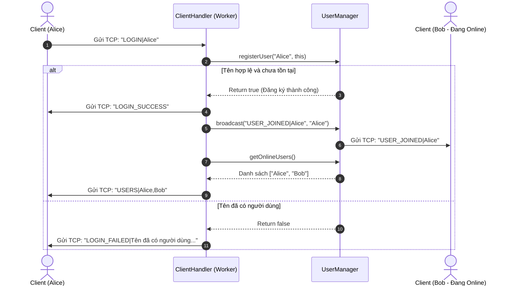

# PRESENTATION_KNOWLEDGE.md
## TÀI LIỆU TOÀN DIỆN VỀ KIẾN TRÚC, NGUYÊN LÝ LẬP TRÌNH MẠNG VÀ KỊCH BẢN BẢO VỆ ĐỒ ÁN
### PROJECT 01: HỆ THỐNG CHAT & TRUYỀN FILE THEO MÔ HÌNH CLIENT–SERVER QUA TCP SOCKET

---

# PHẦN 1 – NGUYÊN TẮC PHÂN TÍCH VÀ CƠ SỞ DỮ LIỆU THỰC TẾ

Tài liệu này được biên soạn dựa trên việc **rà soát và đối chiếu 100% mã nguồn thực tế** hiện có trong thư mục dự án `Project_01_Chat`. 

### Các nguyên tắc cốt lõi:
1. **Dựa trên Source Code Thực tế:** Mọi phân tích về class, method, tham số, cổng giao tiếp và giao thức đều phản ánh chính xác mã nguồn đang chạy, không dựa trên các ý tưởng giả định hay tài liệu thiết kế cũ chưa được triển khai.
2. **Minh bạch trạng thái hiện thực:** 
   - Những chức năng đã được code và chạy kiểm thử thành công (Phase 1 đến Phase 7) được phân tích chi tiết.
   - Những class/file dạng khung xương (skeleton/stub) còn sót lại từ lúc khởi tạo ban đầu nhưng chưa gắn logic thực tế sẽ được nêu rõ: *"CHƯA CÓ TRONG SOURCE CODE HIỆN TẠI (STUB TỒN DƯ)"*.
3. **Định danh nguồn gốc:** Mọi giải thích nghiệp vụ và mạng đều dẫn chứng theo định dạng: `File` $\rightarrow$ `Class` $\rightarrow$ `Field/Method` $\rightarrow$ `Ý nghĩa mạng`.

---

# PHẦN 2 – TỔNG QUAN SẢN PHẨM

### 1. Thông tin tổng quan
* **Tên sản phẩm:** Hệ thống Chat và Truyền File Client–Server qua TCP Socket (Java Network Application).
* **Mục đích:** Xây dựng một ứng dụng mạng hoàn chỉnh cho phép nhiều người dùng kết nối đồng thời đến máy chủ để thực hiện: điểm danh tài khoản (Presence), nhắn tin thời gian thực (phòng chung & riêng 1-1) và truyền nhận tệp tin nhị phân (Binary File Stream) an toàn, hiệu năng cao.
* **Vấn đề thực tế giải quyết:** Mô phỏng cơ chế giao tiếp mạng cục bộ/nội bộ giữa các máy trạm không cần Internet bên ngoài; giải quyết bài toán truyền file lớn mà không làm tràn bộ nhớ RAM (Out Of Memory) và không làm tắc nghẽn luồng tin nhắn văn bản.
* **Đối tượng sử dụng:** Người dùng mạng nội bộ (LAN), phòng ban doanh nghiệp, hoặc mô hình học tập/nghiên cứu môn Lập Trình Mạng.

### 2. Mô hình hoạt động tổng thể (Hybrid Client-Server / Napster & Skype Model)

Hệ thống hoạt động theo mô hình **Lai (Hybrid Architecture)** lấy cảm hứng từ Napster và Skype thế hệ đầu:
* **Server trung tâm (Centralized Directory & Signaling Server):** Tiếp nhận kết nối, xác thực định danh (Authentication), duy trì danh bạ Online (Directory Service), định tuyến tin nhắn văn bản (Message Routing) và làm trung gian bắt tay điều phối truyền file (Signaling).
* **Kênh truyền dữ liệu tách biệt (Dual-Port Architecture):**
  * **Port 8888 (Control/Chat Channel):** Kênh văn bản liên tục giữ kết nối (Persistent TCP Connection).
  * **Port 8889 (Data Channel):** Kênh dữ liệu nhị phân chuyên dụng, chỉ mở khi hai bên đồng ý gửi/nhận file và tự đóng ngay khi truyền xong.

```text
               +----------------------------------------+
               |              CHAT SERVER               |
               |  - Port 8888: Chat & Signaling Socket  |
               |  - Port 8889: File Data Pipe Socket    |
               |  - UserManager & ThreadPool            |
               +----------------------------------------+
                             ^     ^     ^
                            /      |      \
                           /       |       \
                          v        v        v
                   +----------+ +----------+ +----------+
                   | Client A | | Client B | | Client C |
                   | (Alice)  | |  (Bob)   | | (Charlie)|
                   +----------+ +----------+ +----------+
```

### 3. Phân định trách nhiệm (Separation of Concerns)

| Thành phần | Trách nhiệm chính trong hệ thống |
| :--- | :--- |
| **SERVER** | 1. Mở `ServerSocket(8888)` lắng nghe kết nối điều khiển.<br>2. Mở `ServerSocket(8889)` đón các luồng truyền nhận file.<br>3. Điều phối luồng làm việc bằng `ExecutorService` (Cached ThreadPool).<br>4. Quản lý trạng thái danh bạ người dùng online (`UserManager`).<br>5. Kiểm tra tính hợp lệ và chống trùng lặp tên người dùng khi đăng nhập.<br>6. Định tuyến tin nhắn: Tin nhắn phòng chung (Broadcast) và Tin nhắn riêng 1-1 (Unicast).<br>7. Điều phối bắt tay truyền file (`FILE_REQUEST` $\rightarrow$ `FILE_OFFER` $\rightarrow$ `FILE_ACCEPT`/`REJECT`).<br>8. Chuyển tiếp byte stream của file qua bộ đệm 4KB mà không ghi đè vào RAM Server.<br>9. Phát hiện ngắt kết nối đột ngột và thông báo cho toàn mạng (`USER_LEFT`).<br>10. Ghi log hoạt động có kèm mốc thời gian (`ServerLogger`). |
| **CLIENT** | 1. Khởi tạo `Socket` kết nối tới Server bằng IP và Port.<br>2. Gửi yêu cầu đăng nhập bằng username.<br>3. Chạy luồng ngầm (`MessageReceiver`) liên tục lắng nghe phản hồi từ Server.<br>4. Hiển thị danh sách người dùng online theo thời gian thực.<br>5. Cho phép người dùng chuyển đổi linh hoạt giữa Chat Chung và Chat Riêng 1-1.<br>6. Quản lý lịch sử hội thoại riêng biệt theo từng tab/người nhận (`chatHistories`).<br>7. Cho phép chọn file từ máy tính qua hộp thoại `JFileChooser`.<br>8. Cho phép người nhận Chấp nhận (`Accept`) hoặc Từ chối (`Reject`) khi có người gửi file.<br>9. Gửi/Nhận file nhị phân qua cổng 8889 bằng `FileInputStream`/`FileOutputStream` và lưu vào thư mục `receive_files/`.<br>10. Giao diện đồ họa Swing trực quan, phân tách hoàn toàn nghiệp vụ Socket khỏi luồng đồ họa EDT. |

---

# PHẦN 3 – KIẾN TRÚC SOURCE CODE THỰC TẾ

### 1. Cây thư mục thực tế trên ổ đĩa

```text
d:\JAVAFTP\Project_01_Chat/
├── ChatServer/
│   └── src/server/
│       ├── ChatServer.java           # Điểm khởi chạy Server chính (Mở port 8888 & 8889)
│       ├── ClientHandler.java        # Xử lý toàn bộ logic giao thức và phiên làm việc của 1 Client
│       ├── ConnectionManager.java    # [STUB CŨ] Chưa dùng trong luồng chạy chính
│       ├── FileTransferService.java  # Dịch vụ quản lý session và pipe byte stream tại port 8889
│       ├── MessageService.java       # [STUB CŨ] Chưa dùng trong luồng chạy chính
│       ├── Protocol.java             # Bộ hằng số lệnh giao thức Server
│       ├── ServerLogger.java         # Tiện ích ghi log có timestamp
│       └── UserManager.java          # Quản trị Thread-safe danh bạ Online Users
│
├── ChatClient/
│   └── src/
│       ├── client/
│       │   ├── ChatClient.java       # Entry point khởi chạy ứng dụng Client Swing
│       │   ├── ChatEventListener.java# Interface callback nhận sự kiện từ mạng về UI
│       │   ├── ChatService.java      # Lớp dịch vụ nghiệp vụ (Tách biệt Socket khỏi UI)
│       │   ├── FileReceiver.java     # Worker thread tải file nhị phân lưu vào receive_files/
│       │   ├── FileSender.java       # Worker thread đọc file và bơm byte stream lên cổng 8889
│       │   ├── MessageReceiver.java  # Luồng ngầm liên tục đọc gói tin từ ServerConnection
│       │   ├── Protocol.java         # Bộ hằng số lệnh giao thức phía Client
│       │   └── ServerConnection.java # Đóng gói Socket TCP, luồng đọc/ghi text UTF-8
│       │
│       └── ui/
│           ├── LoginFrame.java       # Giao diện cửa sổ Đăng nhập (Host, Port, Username)
│           └── ChatFrame.java        # Giao diện chính: Chat, Danh sách Online, File Transfer
│
├── receive_files/                    # Thư mục lưu trữ các file tải về
├── test_demo.txt                     # File dữ liệu mẫu phục vụ kiểm thử
├── build.gradle                      # File cấu hình biên dịch Gradle
└── README.md                         # Tài liệu hướng dẫn sử dụng dự án
```

### 2. Bảng phân tích chi tiết toàn bộ các Class trong dự án

| File | Class / Interface | Phân hệ | Nhiệm vụ cụ thể trong mã nguồn | Kiến thức Lập Trình Mạng & Java liên quan |
| :--- | :--- | :---: | :--- | :--- |
| `ChatServer.java` | `ChatServer` | Server | Khởi tạo ServerSocket port 8888, kích hoạt `FileTransferService` port 8889, vòng lặp `accept()` lắng nghe kết nối và ném vào `ExecutorService`. | `ServerSocket`, `Socket`, `accept()`, Thread Pool, `ExecutorService`. |
| `ClientHandler.java` | `ClientHandler` | Server | Cài đặt `Runnable`. Mỗi kết nối Client được gán 1 `ClientHandler`. Chịu trách nhiệm đọc từng dòng text, phân tích lệnh giao thức, gọi `UserManager` và gửi phản hồi. | `Runnable`, Multi-threading, I/O Streams (`BufferedReader`, `PrintWriter`), Protocol Parsing. |
| `UserManager.java` | `UserManager` | Server | Lưu trữ danh bạ người dùng online trong bộ nhớ RAM qua `ConcurrentHashMap<String, ClientHandler>`, chống trùng tên, hỗ trợ hàm `broadcast()`. | Thread Safety, `ConcurrentHashMap`, Presence Management, Directory Service. |
| `FileTransferService.java` | `FileTransferService` | Server | Mở `ServerSocket(8889)`. Quản lý `TransferSession`. Ghép đôi Socket của Sender và Receiver bằng `transferId` rồi pipe luồng byte qua buffer 4KB. | Dedicated Data Port, TCP Streaming, Byte Array Buffer Chunking, Asynchronous Pipe. |
| `ServerLogger.java` | `ServerLogger` | Server | Tiện ích in nhật ký hệ thống ra Console kèm định dạng ngày giờ chuẩn `yyyy-MM-dd HH:mm:ss`. | Logging, `DateTimeFormatter`, `Thread-safe standard stream`. |
| `Protocol.java` (Server) | `Protocol` | Server | Định nghĩa tập hợp các hằng số chuỗi: Header lệnh (`LOGIN`, `MESSAGE`, `FILE_REQUEST`,...), ký tự phân cách (`|`), và cổng truyền file `8889`. | Application Protocol Definition, Message Delimiting. |
| `ConnectionManager.java` | `ConnectionManager` | Server | *[Stub cũ]* Ban đầu định dùng quản lý socket, nhưng hiện tại toàn bộ logic này đã được tối ưu tích hợp trực tiếp trong `UserManager`. | Tồn dư kiến trúc khung xương ban đầu. |
| `MessageService.java` | `MessageService` | Server | *[Stub cũ]* Ban đầu định tách service chat, hiện tại logic định tuyến tin nhắn được xử lý tối ưu trực tiếp bên trong `ClientHandler.handleMessage()`. | Tồn dư kiến trúc khung xương ban đầu. |
| `ChatClient.java` | `ChatClient` | Client | Điểm kích hoạt chương trình Client (`main`). Cài đặt giao diện hệ thống (System LookAndFeel) và hiển thị `LoginFrame` lên Swing EDT. | Entry Point, Swing UI Threading (`SwingUtilities.invokeLater`). |
| `ServerConnection.java` | `ServerConnection` | Client | Đóng gói đối tượng `Socket`. Khởi tạo `BufferedReader` và `PrintWriter` mã hóa UTF-8. Chịu trách nhiệm kết nối, ngắt kết nối, gửi và đọc dữ liệu thô. | Client Socket Lifecycle, Network Streams, Encoding `StandardCharsets.UTF_8`. |
| `MessageReceiver.java` | `MessageReceiver` | Client | Luồng chạy ngầm (`implements Runnable`) chứa vòng lặp `while((line = connection.readLine()) != null)` để đón nhận dữ liệu từ server liên tục không chặn UI. | Daemon Thread, Blocking I/O read, Decoupled Receiver. |
| `ChatService.java` | `ChatService` | Client | Trung tâm điều phối nghiệp vụ mạng phía Client. Chuyển các thao tác của UI thành gói tin Protocol, tiếp nhận gói tin từ `MessageReceiver` và kích hoạt callback sang UI. | Facade Pattern, Separation of Concerns (SoC), Service Layer. |
| `ChatEventListener.java` | `ChatEventListener` | Client | Interface định nghĩa các phương thức phản hồi sự kiện mạng: `onLoginSuccess`, `onUsersUpdated`, `onMessageReceived`, `onFileOffer`,... | Observer Pattern, Callback Mechanism, Loose Coupling. |
| `FileSender.java` | `FileSender` | Client | Luồng chạy ngầm (`Runnable`). Đọc file nguồn từ đĩa qua `FileInputStream`, mở kết nối tới port 8889 của Server, gửi bắt tay `SEND|transferId` và đẩy byte theo khối 4KB. | `FileInputStream`, Socket `OutputStream`, Chunking Streaming, Progress Tracking. |
| `FileReceiver.java` | `FileReceiver` | Client | Luồng chạy ngầm (`Runnable`). Kết nối tới port 8889, gửi bắt tay `RECV|transferId`, hứng đúng `fileSize` byte từ socket và ghi vào đĩa qua `FileOutputStream`. | `FileOutputStream`, Socket `InputStream`, Byte boundary flow, File persistence. |
| `Protocol.java` (Client) | `Protocol` | Client | Bảng hằng số giao thức đồng bộ hoàn toàn với phía Server. | Protocol Synchronization. |
| `LoginFrame.java` | `LoginFrame` | Client | Cửa sổ đồ họa đăng nhập (`JFrame`). Nhận Host, Port, Username từ người dùng, gọi `ChatService.connectAndLogin()`, bắt lỗi trùng tên hoặc mất kết nối. | Swing GUI Components (`JTextField`, `JButton`), Input Validation, Asynchronous Login. |
| `ChatFrame.java` | `ChatFrame` | Client | Cửa sổ phòng chat chính. Quản lý danh sách online `JList`, hiển thị tin nhắn `JTextArea`, tích hợp `JFileChooser` gửi file, hiển thị popup nhận file `JOptionPane`. | Swing Event Dispatch Thread (EDT), Multi-conversation isolation, GUI Event Handling. |

---

# PHẦN 4 – PHASE 1: NỀN TẢNG TCP SOCKET VÀ LUỒNG KẾT NỐI MẠNG

### 1. Bản chất các khái niệm mạng trong đồ án

* **TCP (Transmission Control Protocol) là gì?**
  Là giao thức truyền vận (Transport Layer) hướng kết nối (Connection-oriented), cung cấp kênh truyền dữ liệu tin cậy, bảo đảm các byte gửi đi sẽ đến đích nguyên vẹn, đúng thứ tự và không bị mất mát hoặc trùng lặp nhờ cơ chế kiểm tra lỗi (Checksum), báo nhận (ACK), truyền lại gói tin (Retransmission) và kiểm soát tắc nghẽn (Flow/Congestion Control).
* **Vì sao project bắt buộc phải dùng TCP thay vì UDP?**
  * **Ứng dụng Chat:** Tin nhắn văn bản yêu cầu tính chính xác 100%. Nếu dùng UDP, các gói tin có thể bị rơi rớt hoặc đảo lộn thứ tự khiến tin nhắn bị mất chữ, sai ngữ nghĩa.
  * **Truyền nhận File:** Một tệp tin nhị phân (ảnh, word, pdf, zip) chỉ cần hỏng hoặc mất 1 byte duy nhất là toàn bộ file sẽ bị lỗi (corrupted) và không thể mở được. TCP đảm bảo truyền đầy đủ 100% từng byte của file.
* **IP (Internet Protocol Address):** Là địa chỉ định danh duy nhất của một thiết bị trong mạng logic (ví dụ `127.0.0.1` hay `localhost` để chỉ chính máy trạm hiện tại).
* **Port (Cổng dịch vụ):** Là số nguyên 16-bit (từ 0 đến 65535) giúp hệ điều hành định tuyến dữ liệu từ card mạng đến chính xác tiến trình phần mềm (Process) đang chờ nhận. Trong bài: Port `8888` cho chat, Port `8889` cho file data.
* **Socket là gì?** Là một đầu cuối (Endpoint) của kênh truyền thông hai chiều giữa hai tiến trình phần mềm qua mạng. Trong Java, class `java.net.Socket` đại diện cho một kết nối TCP phía Client.
* **ServerSocket là gì?** Là đối tượng đặc biệt trên Server (`java.net.ServerSocket`), có nhiệm vụ gắn kết với một cổng dịch vụ (`bind`) và đưa hệ điều hành vào trạng thái lắng nghe (`listen`) yêu cầu kết nối từ các Client từ xa.
* **Hàm `accept()`:** Là lời gọi hàm có tính chất **chặn luồng (Blocking call)**. Khi Server chạy tới `serverSocket.accept()`, luồng đó sẽ dừng lại ngủ cho tới khi có một Client gửi gói tin yêu cầu kết nối TCP (SYN). Sau khi tiến trình bắt tay 3 bước thành công, `accept()` trả về một đối tượng `Socket` đại diện cho kênh giao tiếp riêng với Client đó.
* **Hàm `connect()`:** Quá trình Client khởi tạo `new Socket(host, port)` sẽ tự động phát tín hiệu bắt tay 3 bước (SYN $\rightarrow$ SYN-ACK $\rightarrow$ ACK) tới IP/Port của Server. Nếu Server chưa chạy, hàm này ném ra `ConnectException`.
* **InputStream / OutputStream:**
  * `InputStream`: Luồng byte đầu vào nhận dữ liệu được đẩy từ bên kia mạng đến (`socket.getInputStream()`).
  * `OutputStream`: Luồng byte đầu ra để đẩy dữ liệu qua mạng sang bên đối diện (`socket.getOutputStream()`).

### 2. Định vị Source Code thực tế thực thi Phase 1

* **Server Bind & Listen:**
  * File: [ChatServer.java](file:///d:/JAVAFTP/Project_01_Chat/ChatServer/src/server/ChatServer.java)
  * Dòng 27: `try (ServerSocket serverSocket = new ServerSocket(port))`
  * Giải thích: Gắn ServerSocket vào port `8888` của hệ điều hành, kích hoạt cờ lắng nghe kết nối.
* **Server Accept:**
  * File: [ChatServer.java](file:///d:/JAVAFTP/Project_01_Chat/ChatServer/src/server/ChatServer.java)
  * Dòng 33: `Socket clientSocket = serverSocket.accept();`
  * Giải thích: Chặn chờ Client. Khi có Client kết nối, tạo ra `clientSocket` độc lập cho kết nối đó.
* **Client Connect:**
  * File: [ServerConnection.java](file:///d:/JAVAFTP/Project_01_Chat/ChatClient/src/client/ServerConnection.java)
  * Dòng 21: `this.socket = new Socket(host, port);`
  * Giải thích: Client thiết lập bắt tay 3 bước tới máy chủ.
* **Tạo luồng đọc/ghi I/O Stream:**
  * Phía Client ([ServerConnection.java](file:///d:/JAVAFTP/Project_01_Chat/ChatClient/src/client/ServerConnection.java#L22-L23)):
    ```java
    this.reader = new BufferedReader(new InputStreamReader(socket.getInputStream(), StandardCharsets.UTF_8));
    this.writer = new PrintWriter(new OutputStreamWriter(socket.getOutputStream(), StandardCharsets.UTF_8), true);
    ```
  * Phía Server ([ClientHandler.java](file:///d:/JAVAFTP/Project_01_Chat/ChatServer/src/server/ClientHandler.java#L31-L32)):
    ```java
    reader = new BufferedReader(new InputStreamReader(socket.getInputStream(), StandardCharsets.UTF_8));
    writer = new PrintWriter(new OutputStreamWriter(socket.getOutputStream(), StandardCharsets.UTF_8), true);
    ```
  * *Ý nghĩa kỹ thuật:* `InputStreamReader` chuyển đổi byte thô thành ký tự Unicode theo bảng mã UTF-8. `BufferedReader` thêm vùng đệm để đọc từng dòng bằng `readLine()`. `PrintWriter(..., true)` kích hoạt cờ `autoFlush` để dữ liệu lập tức được đẩy qua mạng ngay khi gọi `println()`.

### 3. Sơ đồ tuần tự bắt tay và trao đổi mạng cơ bản

```text
       Client                                       Server
         |                                             |
         |                                  ServerSocket.bind(8888)
         |                                  ServerSocket.accept() [BLOCKING]
         |                                             |
   new Socket(host, 8888)                              |
         | ------------ TCP 3-Way Handshake ---------> |
         | <----------- (SYN, SYN-ACK, ACK) ---------- |
         |                                             | ---> accept() trả về clientSocket
         |                                             |      Tạo ClientHandler(clientSocket)
   Tạo Reader & Writer                                Tạo Reader & Writer
         |                                             |
         | --------- Dữ liệu Text (readLine) --------> |
         | <-------- Dữ liệu Text (println) ---------- |
         |                                             |
```

---

# PHẦN 5 – PHASE 2: MULTI-CLIENT VÀ BÀI TOÁN ĐỒNG THỜI (CONCURRENCY)

### 1. Tại sao Server bắt buộc phải Đa luồng (Multi-threading)?

Nếu Server chỉ chạy đơn luồng (Single-threaded), vòng lặp của Server sẽ như sau:
`accept() Client A` $\rightarrow$ `xử lý đọc/ghi với Client A`.
Trong suốt thời gian Client A đang kết nối, luồng của Server bị chiếm dụng hoàn toàn. Nếu Client B, Client C cố gắng kết nối đến, các yêu cầu này sẽ bị treo trong hàng đợi TCP backlog hoặc bị từ chối kết nối (Connection Refused). Server bị tê liệt hoàn toàn khi phục vụ nhiều người.

$\Rightarrow$ **Giải pháp kiến trúc:** Tách biệt luồng Lắng nghe (`Acceptor`) và luồng Xử lý kết nối (`Worker`). Luồng lắng nghe chỉ làm đúng 1 việc: Đón Client mới vào, sau đó ủy thác kết nối đó cho một luồng Worker riêng và lập tức quay lại `accept()` chờ người tiếp theo.

### 2. Hiện thực Multi-Client bằng ExecutorService trong Code thực tế

* **File:** [ChatServer.java](file:///d:/JAVAFTP/Project_01_Chat/ChatServer/src/server/ChatServer.java)
* **Khai báo ThreadPool (Dòng 14):**
  ```java
  private static final ExecutorService threadPool = Executors.newCachedThreadPool();
  ```
* **Vòng lặp phân phối luồng (Dòng 30–38):**
  ```java
  while (!serverSocket.isClosed()) {
      Socket clientSocket = serverSocket.accept();
      // Đóng gói socket vào một Runnable Worker
      ClientHandler clientHandler = new ClientHandler(clientSocket, userManager, fileTransferService);
      // Đẩy vào threadPool thực thi bất đồng bộ
      threadPool.execute(clientHandler);
  }
  ```

### 3. Phân tích sâu: Tại sao chọn `Executors.newCachedThreadPool()`?

Trong môn Lập Trình Mạng, có 3 cách xử lý đa luồng:
1. **Cách cổ điển (`new Thread(r).start()`):** Mỗi Client tạo một thread mới. Cực kỳ tốn tài nguyên hệ điều hành, nếu có 1000 Client sẽ tạo 1000 Thread dẫn đến tràn bộ nhớ RAM (OutOfMemoryError: unable to create new native thread).
2. **`FixedThreadPool(N)`:** Cố định N luồng. An toàn nhưng nếu cấu hình N=10 mà có 11 Client vào thì Client thứ 11 phải xếp hàng đợi người trước ngắt kết nối mới được phục vụ.
3. **`CachedThreadPool()` (Lựa chọn của dự án):** 
   * Tự động tái sử dụng các thread nhàn rỗi (idle threads).
   * Nếu không có sẵn thread, nó tự động tạo thêm thread mới để đáp ứng tức thì.
   * Nếu thread nhàn rỗi quá 60 giây không có việc làm, nó tự động tiêu hủy để hoàn trả RAM cho hệ thống.
   * Cực kỳ tối ưu cho các ứng dụng chat socket có nhiều kết nối kết nối-ngắt kết nối liên tục.

### 4. Quản lý Dữ liệu dùng chung (Shared Data) và Tránh Race Condition

* **Dữ liệu dùng chung (Shared State) là gì?**
  Là danh bạ lưu trữ danh sách người dùng đang online trên toàn Server.
* **File hiện thực:** [UserManager.java](file:///d:/JAVAFTP/Project_01_Chat/ChatServer/src/server/UserManager.java)
* **Cấu trúc lưu trữ (Dòng 11):**
  ```java
  private final Map<String, ClientHandler> onlineUsers = new ConcurrentHashMap<>();
  ```
* **Phân tích kỹ thuật phòng chống xung đột luồng (Race Condition):**
  * Nhiều luồng `ClientHandler` chạy song song cùng lúc có thể đồng thời gọi hàm đăng nhập hoặc đăng xuất.
  * Nếu dùng `HashMap` thông thường: Việc đọc/ghi đồng thời trên nhiều luồng sẽ gây ra lỗi `ConcurrentModificationException` hoặc làm hỏng cấu trúc bảng băm (Hash collision).
  * Dự án sử dụng **`ConcurrentHashMap`**: Cung cấp cơ chế khóa phân đoạn (Lock Striping / CAS - Compare-And-Swap), cho phép nhiều luồng đọc và ghi đồng thời trên các phân vùng khác nhau mà không cần khóa toàn bộ Map.
  * **Hàm đăng ký tài khoản nguyên tử (`putIfAbsent` - Dòng 18):**
    ```java
    return onlineUsers.putIfAbsent(username.trim(), handler) == null;
    ```
    Hàm `putIfAbsent` được thực thi nguyên tử (Atomic operation) ở cấp độ phần cứng/JVM. Nếu hai Client cùng cố gắng đăng ký tên `Alice` tại cùng 1 mili-giây, chỉ có đúng một luồng thành công ghi vào map, luồng còn lại sẽ nhận giá trị khác null và bị từ chối ngay lập tức. Điều này triệt tiêu 100% nguy cơ Race Condition khi kiểm tra trùng lặp tên đăng nhập!

---

# PHẦN 6 – PHASE 3: LUỒNG ĐĂNG NHẬP VÀ QUẢN LÝ ONLINE USERS (PRESENCE)

### 1. Luồng nghiệp vụ Đăng nhập (Step-by-step Flow)

1. Client mở kết nối Socket tới Server.
2. Client gửi chuỗi văn bản: `LOGIN|<tên_đăng_nhập>`.
3. Luồng `ClientHandler` của Client đó đón nhận gói tin tại hàm `processCommand()`.
4. Gọi `userManager.registerUser(requestedName, this)`:
   - Kiểm tra tên có rỗng không.
   - Kiểm tra tên có chứa ký tự cấm (`|` hoặc `,`) không.
   - Thực thi `onlineUsers.putIfAbsent()`.
5. **Nếu thành công:**
   - Gán `this.username = requestedName`.
   - Server gửi lại cho Client: `LOGIN_SUCCESS`.
   - Server gọi `userManager.broadcast("USER_JOINED|" + username, username)` để báo cho toàn bộ các Client khác đang online cập nhật UI.
   - Server tự động gọi `handleGetUsers()` gửi chuỗi `USERS|user1,user2...` cho chính Client vừa vào.
6. **Nếu thất bại:**
   - Server gửi lại: `LOGIN_FAILED|Tên '<tên>' đã có người dùng...`.
   - Socket vẫn mở để Client có cơ hội nhập lại tên khác mà không bị ngắt kết nối.

### 2. Sơ đồ tuần tự Đăng nhập (Sequence Diagram)



### 3. Vị trí lưu trữ dữ liệu thực tế trong Code

* **Username lưu ở đâu?** Lưu trong biến thực thể `private String username;` của từng đối tượng [ClientHandler.java](file:///d:/JAVAFTP/Project_01_Chat/ChatServer/src/server/ClientHandler.java#L20) và biến `private String currentUsername;` trong [ChatService.java](file:///d:/JAVAFTP/Project_01_Chat/ChatClient/src/client/ChatService.java#L20).
* **Password xử lý ở đâu?** Trong phiên bản MVP hiện tại, hệ thống xác thực dựa trên định danh duy nhất (Username Identification), **CHƯA CÓ TRONG SOURCE CODE HIỆN TẠI** bảng mật khẩu/database để giữ ứng dụng tối giản, tập trung vào giao thức mạng.
* **Online users lưu ở đâu?** Lưu tập trung tại máy chủ trong cấu trúc `private final Map<String, ClientHandler> onlineUsers` của [UserManager.java](file:///d:/JAVAFTP/Project_01_Chat/ChatServer/src/server/UserManager.java#L11).
* **Xử lý Đăng xuất / Mất mạng đột ngột:**
  * File: [ClientHandler.java](file:///d:/JAVAFTP/Project_01_Chat/ChatServer/src/server/ClientHandler.java#L202-L220)
  * Hàm: `public void close()`
  * Logic: Khi luồng `run()` kết thúc (do Client gửi `LOGOUT` hoặc ném ra ngoại lệ `IOException` khi rút dây mạng/đóng ứng dụng), khối `finally` luôn gọi hàm `close()`. Hàm này sẽ gọi `userManager.removeUser(username)` và phát thông báo `USER_LEFT|<username>` tới toàn bộ người dùng còn lại.

---

# PHẦN 7 – PHASE 4: ĐỊNH TUYẾN TIN NHẮN (CHAT 1-1 VÀ BROADCAST)

### 1. Luồng định tuyến tin nhắn 1-1 qua Server

Khi Client Alice gửi tin nhắn cho Client Bob:
1. Alice gửi lệnh lên Server: `MESSAGE|Bob|Chào Bob, bạn khỏe không?`
2. Luồng `ClientHandler` của Alice tiếp nhận, phân tích `receiver = "Bob"` và `content = "Chào Bob, bạn khỏe không?"`.
3. `ClientHandler` của Alice truy vấn tới `UserManager`:
   ```java
   ClientHandler targetClient = userManager.getClient("Bob");
   ```
4. Nếu tìm thấy `targetClient` (Bob đang online):
   - Server lấy Socket OutputStream của Bob để gửi gói tin:
     `MESSAGE_FROM|Alice|Chào Bob, bạn khỏe không?`
   - Server gửi phản hồi xác nhận cho Alice:
     `MESSAGE_SENT|Bob|Chào Bob, bạn khỏe không?`
5. Nếu Bob không online (`targetClient == null`):
   - Server gửi thông báo lỗi ngược lại cho Alice:
     `ERROR|Người dùng 'Bob' không online hoặc không tồn tại.`

### 2. Tại sao Client không gửi tin nhắn trực tiếp P2P cho nhau mà phải qua Server?

1. **Khắc phục vấn đề Tường lửa (Firewall) và NAT (Network Address Translation):** Trong mạng thực tế, các máy Client thường nằm sau Router mạng nội bộ với IP riêng (Private IP như `192.168.x.x`). Client A không thể tự mở socket kết nối thẳng vào IP riêng của Client B nếu không có cơ chế Port Forwarding hoặc kỹ thuật đục lỗ NAT (NAT Traversal) phức tạp.
2. **Đơn giản hóa mô hình kết nối:** Mỗi Client chỉ cần duy trì đúng **một kết nối TCP duy nhất** tới Server thay vì phải mở N kết nối tới N người dùng khác nhau trong phòng chat (Mesh Topology làm cạn kiệt tài nguyên mạng và CPU máy trạm).
3. **Kiểm soát và quản trị tập trung:** Mọi tin nhắn đi qua Server giúp quản trị viên có thể kiểm duyệt, lưu trữ lịch sử hoặc ngăn chặn các hành vi tấn công từ chối dịch vụ (DDoS) giữa các Client.

---

# PHẦN 8 – GIAO THỨC TẦNG ỨNG DỤNG (APPLICATION PROTOCOL SPECIFICATION)

### 1. Bảng đặc tả toàn bộ Giao thức thực tế trong Source Code

Tất cả các hằng số này được định nghĩa tại [Protocol.java](file:///d:/JAVAFTP/Project_01_Chat/ChatServer/src/server/Protocol.java):

| Tên Lệnh (Command) | Chiều gửi | Định dạng dữ liệu (Payload Format) | Ý nghĩa nghiệp vụ |
| :--- | :---: | :--- | :--- |
| `LOGIN` | Client $\rightarrow$ Server | `LOGIN\|<username>` | Yêu cầu đăng nhập định danh vào hệ thống. |
| `LOGIN_SUCCESS` | Server $\rightarrow$ Client | `LOGIN_SUCCESS` | Thông báo đăng nhập thành công. |
| `LOGIN_FAILED` | Server $\rightarrow$ Client | `LOGIN_FAILED\|<lý_do>` | Thông báo đăng nhập thất bại (trùng tên/rỗng). |
| `GET_USERS` | Client $\rightarrow$ Server | `GET_USERS` | Yêu cầu Server trả về danh sách user online. |
| `USERS` | Server $\rightarrow$ Client | `USERS\|<user1>,<user2>,...` | Trả về danh sách người dùng online, phân cách bằng dấu phẩy. |
| `MESSAGE` | Client $\rightarrow$ Server | `MESSAGE\|<receiver>\|<nội_dung>` | Gửi tin nhắn tới `<receiver>` (hoặc `"ALL"` cho phòng chung). |
| `MESSAGE_FROM` | Server $\rightarrow$ Client | `MESSAGE_FROM\|<sender>\|<nội_dung>` | Chuyển tiếp tin nhắn đến người nhận. |
| `USER_JOINED` | Server $\rightarrow$ Client | `USER_JOINED\|<username>` | Thông báo có thành viên mới vừa đăng nhập online. |
| `USER_LEFT` | Server $\rightarrow$ Client | `USER_LEFT\|<username>` | Thông báo có thành viên vừa ngắt kết nối/rời phòng. |
| `FILE_REQUEST` | Client $\rightarrow$ Server | `FILE_REQUEST\|<receiver>\|<fileName>\|<fileSize>` | Người gửi yêu cầu Server làm trung gian gửi file tới người nhận. |
| `FILE_OFFER` | Server $\rightarrow$ Client | `FILE_OFFER\|<transferId>\|<sender>\|<fileName>\|<fileSize>` | Server thông báo cho bên nhận về lời mời gửi file. |
| `FILE_ACCEPT` | Cả 2 chiều | `FILE_ACCEPT\|<transferId>\|<fileName>` | Bên nhận bấm đồng ý; Server kích hoạt 2 bên mở luồng tải. |
| `FILE_REJECT` | Cả 2 chiều | `FILE_REJECT\|<transferId>\|<lý_do>` | Bên nhận từ chối; Server thông báo lại cho bên gửi hủy bỏ. |
| `LOGOUT` | Client $\rightarrow$ Server | `LOGOUT` | Client chủ động đăng xuất khỏi hệ thống. |
| `ERROR` | Server $\rightarrow$ Client | `ERROR\|<thông_báo>` | Server phản hồi thông báo lỗi hoặc nhắc nhở cho Client. |

### 2. Bản chất Đóng gói bản tin (Message Framing) trong TCP

* **Bản chất của TCP:** TCP là giao thức hướng luồng byte (Byte Stream-oriented), nó **hoàn toàn không có khái niệm về ranh giới gói tin (Message Boundary)**. Dữ liệu gửi đi nhiều lần có thể bị gộp lại thành một khối byte (TCP Packet Coalescing / Nagle's Algorithm) hoặc một lần gửi có thể bị xé nhỏ ra nhiều phân đoạn (Packet Fragmentation).
* **Giải pháp Framing của dự án:** 
  1. **Ký tự kết thúc dòng (Delimiter-based Framing):** Dự án sử dụng ký tự xuống dòng `\n` (thông qua hàm `println()` và `readLine()`) làm ranh giới kết thúc của một thông điệp điều khiển. `BufferedReader.readLine()` sẽ tích lũy các byte trong stream cho tới khi gặp đúng ký tự `\n` mới trả về một Message hoàn chỉnh.
  2. **Ký tự phân tách trường dữ liệu (Field Delimiter):** Trong mỗi dòng lệnh, dự án sử dụng ký tự gạch đứng `|` (`Protocol.DELIMITER`) để phân tách giữa Tên Lệnh (Header) và các Tham số (Payload).

---

# PHẦN 9 – PHASE 5: TRUYỀN FILE NHỊ PHÂN THEO KHỐI (CHUNK STREAMING)

### 1. Kiến trúc Hai Cổng (Dual-Port Architecture) cho File Transfer

Tại sao hệ thống không truyền dữ liệu file trực tiếp trên kết nối chat cổng 8888?
1. **Tránh làm sai lệch dữ liệu nhị phân:** Cổng 8888 sử dụng `InputStreamReader` và `BufferedReader` được thiết kế để xử lý ký tự văn bản (Text/Characters). Tệp tin nhị phân (ảnh, exe, zip, word) chứa các byte ngẫu nhiên từ `0x00` đến `0xFF`. Nếu chuyển đổi qua bảng mã Unicode UTF-8, các byte này sẽ bị biến đổi ký tự làm hỏng file (Corrupted File).
2. **Không làm nghẽn kênh chat:** Nếu truyền một file dung lượng 500MB trên cùng một luồng Socket với tin nhắn văn bản, việc đọc luồng file sẽ chiếm trọn băng thông socket khiến người dùng không thể gửi hay nhận thêm bất kỳ tin nhắn chat nào cho tới khi file truyền xong.

$\Rightarrow$ **Kiến trúc giải quyết:** Dự án mở riêng cổng **Port 8889** dành riêng cho luồng dữ liệu nhị phân (`InputStream` / `OutputStream` nguyên thủy không qua bọc Text Reader/Writer).

### 2. Luồng truyền file chi tiết từ lúc chọn file đến khi lưu đĩa

```text
[Alice (Sender)]                   [ChatServer]                   [Bob (Receiver)]
       |                                |                                |
 (1) Chọn file (1MB)                   |                                |
  FILE_REQUEST|Bob|demo.txt|1048576 --->|                                |
       |                                | (2) Tạo transferId = "F12345"  |
       |                                | ---- FILE_OFFER|F12345... ---> |
       |                                |                                |
       |                                |                        (3) Hiện popup:
       |                                |                            Accept / Reject?
       |                                | <--- FILE_ACCEPT|F12345 ------- (Bấm Yes)
       | <--- FILE_ACCEPT|F12345 -------|
       |                                |
       | === KẾT NỐI DATA PORT 8889 ===>| <=== KẾT NỐI DATA PORT 8889 ===|
       | Gửi: "SEND|F12345\n"           | Gửi: "RECV|F12345\n"           |
       |                                |                                |
       | -------- Byte Stream (Chunk 4KB qua Socket 8889) -------------> |
       |                                |                                | Ghi vào file:
       |                                |                                | receive_files/demo.txt
       |                                |                                |
 (4) Hoàn thành!                   (5) Xóa Session                  (6) Tải xong 100%!
```

### 3. Phân tích kỹ thuật: Cơ chế Đệm 4KB (`byte[] buffer = new byte[4096]`)

Trong [FileSender.java](file:///d:/JAVAFTP/Project_01_Chat/ChatClient/src/client/FileSender.java#L39) và [FileReceiver.java](file:///d:/JAVAFTP/Project_01_Chat/ChatClient/src/client/FileReceiver.java#L47):
```java
byte[] buffer = new byte[4096]; // Vùng đệm 4KB
```
* **Tại sao là 4KB (4096 bytes)?** 
  * 4096 bytes là kích thước tiêu chuẩn của một Block (Cluster) trên hầu hết các hệ điều hành hiện đại (Windows NTFS, Linux ext4).
  * Việc đọc/ghi dữ liệu ổ cứng theo bội số của 4KB giúp bộ điều khiển đĩa tối ưu hóa các chu kỳ đọc/ghi vật lý (I/O Operations), đạt tốc độ truyền tải cao nhất.
* **Tại sao không đọc toàn bộ file vào RAM (`byte[] fileData = Files.readAllBytes(...)`)?**
  * Nếu người dùng gửi một file video 2GB hoặc 5GB, việc đọc toàn bộ file vào bộ nhớ RAM sẽ gây cạn kiệt Heap Memory của Java Virtual Machine, dẫn đến lỗi sập ứng dụng kinh điển: `java.lang.OutOfMemoryError: Java heap space`.
  * Với giải pháp Chunking 4KB của dự án: Dù tệp tin có dung lượng 10MB hay 100GB, lượng RAM tiêu thụ tại mỗi thời điểm luôn **cố định chỉ 4KB**!

---

# PHẦN 10 – AN TOÀN VÀ TÍNH TOÀN VẸN CỦA FILE (FILE INTEGRITY & SAFETY)

Kiểm tra đối chiếu thực tế với mã nguồn:

| Tiêu chí an toàn | Trạng thái trong Code | Vị trí Source Code & Cơ chế xử lý thực tế |
| :--- | :---: | :--- |
| **Kiểm tra File tồn tại** | **ĐÃ CÓ** | `ChatClient.java` (dòng 155): `if (!file.exists() \|\| !file.isFile())` $\rightarrow$ Ngăn chặn crash nếu file bị xóa hoặc chọn nhầm thư mục. |
| **Kiểm tra File rỗng** | **ĐÃ CÓ** | `ChatClient.java` (dòng 161): `if (fileSize <= 0)` $\rightarrow$ Chặn gửi file 0 byte gây lỗi vòng lặp stream. |
| **Kiểm tra Kích thước nhận** | **ĐÃ CÓ** | `FileReceiver.java` (dòng 51–58): Dùng biến `remaining = fileSize;` đếm chính xác số lượng byte đã ghi, dừng ngay khi nhận đủ, không đọc thừa dữ liệu của kết nối tiếp theo. |
| **Thư mục lưu trữ an toàn** | **ĐÃ CÓ** | `FileReceiver.java` (dòng 35–38): File tải về bắt buộc lưu vào thư mục `receive_files/`, độc lập với source code hệ thống. |
| **Chống Path Traversal (`../`)** | *CHƯA IMPLEMENT* | Hiện tại code lấy trực tiếp `file.getName()` (tên file trần). Tuy nhiên chưa có bộ lọc xóa ký tự đặc biệt nguy hiểm như `../` hoặc file trùng tên trong thư mục đích. |
| **Mã băm toàn vẹn (MD5 / SHA-256 Checksum)** | *CHƯA IMPLEMENT* | Hệ thống dựa trên cơ chế sửa lỗi kiểm tra toàn vẹn Checksum tự động của tầng TCP Transport Layer. Chưa có cơ chế băm mã hash MD5/SHA ở tầng ứng dụng. |

---

# PHẦN 11 – PHASE 6: XỬ LÝ LỖI VÀ TÍNH ỔN ĐỊNH HỆ THỐNG (ERROR HANDLING)

Bảng tổng hợp tất cả các kịch bản lỗi thực tế đã được xử lý trong code:

| Kịch bản lỗi | Nguyên nhân phát sinh | File & Class | Method | Cách thức hệ thống xử lý |
| :--- | :--- | :--- | :--- | :--- |
| **Server chưa chạy** | Client mở lên nhưng Server chưa bật. | `ChatService.java` | `connectAndLogin()` | Bắt `IOException`, kích hoạt callback `listener.onLoginFailed()` hiện thông báo cho người dùng, không để ứng dụng bị crash. |
| **Sai IP hoặc Sai Port** | Nhập sai địa chỉ IP hoặc port không có tiến trình nghe. | `LoginFrame.java` | `handleLogin()` | Bắt `NumberFormatException` kiểm tra port là số; bắt `ConnectException` khi kết nối thất bại. |
| **Trùng tên đăng nhập** | Người dùng nhập username đã có người online. | `ClientHandler.java` | `handleLogin()` | Server kiểm tra `userManager.registerUser()`, trả về `LOGIN_FAILED`, Client hiển thị `JOptionPane` yêu cầu nhập tên khác. |
| **Client tắt đột ngột (Mất mạng)** | Rút cáp mạng, tắt task manager. | `ClientHandler.java` | `run()` & `close()` | Vòng lặp đọc phát hiện kết thúc luồng (EOF / null) hoặc `SocketException`, khối `finally` tự động hủy đăng ký trong `UserManager` và phát `USER_LEFT`. |
| **Server dừng đột ngột** | Server bị tắt trong khi Client đang chat. | `MessageReceiver.java` | `run()` | `connection.readLine()` ném ra `SocketException`, bắt lỗi và kích hoạt `chatService.handleDisconnected()`, Client hiện popup cảnh báo mất kết nối. |
| **Người nhận không tồn tại** | Nhắn tin hoặc gửi file cho người đã offline. | `ClientHandler.java` | `handleMessage()` / `handleFileRequest()` | `userManager.getClient()` trả về `null`, Server gửi phản hồi `ERROR\|Người dùng không online` để Client biết. |
| **Từ chối nhận file** | Người nhận bấm "No" khi có lời mời gửi file. | `ClientHandler.java` | `handleFileReject()` | Gửi thông báo `FILE_REJECT` về cho bên gửi hủy bỏ phiên, dọn dẹp `TransferSession` để giải phóng bộ nhớ. |

---

# PHẦN 12 – PHASE 7: GIAO DIỆN ĐỒ HỌA SWING (UI ARCHITECTURE)

### 1. Kiến trúc phân tách 3 lớp (3-Tier Decoupled Architecture)

Dự án tuân thủ nghiêm ngặt nguyên tắc: **"UI không chứa toàn bộ Socket logic"**.

```text
+-------------------------------------------------------------+
|                 PRESENTATION LAYER (SWING UI)               |
|      LoginFrame.java    <---------->    ChatFrame.java      |
+-------------------------------------------------------------+
                               | (Sự kiện người dùng / Giao diện)
                               v 
+-------------------------------------------------------------+
|                    SERVICE / BUSINESS LAYER                 |
|       ChatService.java   <=======>   ChatEventListener      |
+-------------------------------------------------------------+
                               | (Lệnh mạng cấp cao / Callbacks)
                               v
+-------------------------------------------------------------+
|                     NETWORK / TRANSPORT LAYER               |
|   ServerConnection.java  <--------->  MessageReceiver.java  |
|   FileSender.java                     FileReceiver.java     |
+-------------------------------------------------------------+
```

### 2. Quy tắc an toàn luồng trong Swing: Event Dispatch Thread (EDT)

* **Vấn đề sống còn trong lập trình Swing:** Java Swing là bộ thư viện đơn luồng (Single-threaded GUI toolkit). Mọi thao tác vẽ lại giao diện (Repaint), cập nhật chữ trên Text Area, thêm bớt item trong `JList` **bắt buộc phải chạy trên một luồng duy nhất gọi là Event Dispatch Thread (EDT)**.
* **Nguy cơ nếu không tách luồng:**
  * Nếu thực hiện đọc socket (`readLine()`) trực tiếp trong sự kiện nút bấm của Swing, luồng EDT sẽ bị đóng băng (Freeze/Hanging) chờ mạng. Cửa sổ ứng dụng sẽ bị đơ, hiện dòng chữ *(Not Responding)* và người dùng không thể bấm chuột được nữa.
* **Cách dự án giải quyết chuẩn mực:**
  * Toàn bộ việc đọc dữ liệu mạng được thực hiện trên luồng riêng: `MessageReceiverThread`.
  * Khi có dữ liệu từ mạng cần hiển thị lên giao diện, [ChatService.java](file:///d:/JAVAFTP/Project_01_Chat/ChatClient/src/client/ChatService.java#L199-L205) sử dụng phương thức:
    ```java
    private void notifyUI(Runnable runnable) {
        if (SwingUtilities.isEventDispatchThread()) {
            runnable.run();
        } else {
            SwingUtilities.invokeLater(runnable);
        }
    }
    ```
  * `SwingUtilities.invokeLater` sẽ đưa đoạn mã cập nhật giao diện vào hàng đợi của luồng EDT, đảm bảo giao diện đồ họa chạy siêu mượt, không bao giờ bị giật hay đơ màn hình!

### 3. Cơ chế phân tách lịch sử hội thoại riêng biệt trong `ChatFrame`

* **Vấn đề người dùng hay thắc mắc:** *"Tại sao gửi riêng cho Alice nhưng khi bấm vào Phòng chung vẫn thấy tin nhắn?"*
* **Cách giải quyết thực tế trong code:** 
  Trong [ChatFrame.java](file:///d:/JAVAFTP/Project_01_Chat/ChatClient/src/ui/ChatFrame.java#L47), hệ thống sử dụng một bảng băm lưu trữ lịch sử:
  ```java
  private final Map<String, StringBuilder> chatHistories = new ConcurrentHashMap<>();
  ```
  * Key `[Tất cả - Phòng chung]`: Lưu trữ toàn bộ tin nhắn chat phòng chung.
  * Key `<Tên_User>` (ví dụ `"Alice"`, `"Bob"`): Lưu trữ lịch sử tin nhắn riêng giữa Mình và người đó.
  * Khi người dùng click chuột vào danh sách bên phải: Hàm `switchConversationView()` sẽ xóa màn hình và nạp đúng lịch sử tin nhắn của đối tượng đó. Tin nhắn riêng sẽ **hoàn toàn biến mất khỏi phòng chung**!

---

# PHẦN 13 – END-TO-END FLOW (TRUY VẾT TOÀN BỘ VÒNG ĐỜI HỆ THỐNG)

```text
[1] START SERVER
    File: ChatServer.java -> main()
    - Kích hoạt FileTransferService.start(8889).
    - Tạo ServerSocket(8888).
    - In log: "Server Chat đã sẵn sàng phục vụ tại port 8888...".
    [Kiến thức mạng: ServerSocket Bind & Listen, Non-blocking Port Multiplexing].

[2] CLIENT CONNECT & LOGIN
    File: LoginFrame.java -> handleLogin() -> ChatService.connectAndLogin()
    - Client tạo new Socket("localhost", 8888).
    - Client gửi: "LOGIN|Alice\n".
    - Server tiếp nhận qua ClientHandler.handleLogin().
    - UserManager lưu ("Alice", handler).
    - Server trả về: "LOGIN_SUCCESS\n".
    - Server phát: "USER_JOINED|Alice\n" tới các client khác.
    [Kiến thức mạng: TCP 3-Way Handshake, Presence Signaling].

[3] XEM ONLINE USERS
    File: ChatFrame.java -> requestUserList() -> ServerConnection.send("GET_USERS")
    - Server duyệt qua keys của ConcurrentHashMap.
    - Server gửi về: "USERS|Alice,Bob\n".
    - Client nhận qua ChatEventListener.onUsersUpdated() -> nạp vào JList UI.
    [Kiến thức mạng: Directory Service, Data Serialization qua Delimiter].

[4] CHAT 1-1 (ALICE -> BOB)
    File: ChatFrame.java -> handleSendMessage()
    - Alice chọn Bob trên JList -> Gõ: "Chào Bob".
    - Gửi: "MESSAGE|Bob|Chào Bob\n".
    - Server tiếp nhận tại ClientHandler.handleMessage().
    - Server tìm handler của Bob: targetClient.sendMessage("MESSAGE_FROM|Alice|Chào Bob").
    - Bob nhận gói tin -> ChatFrame của Bob hiển thị trong tab riêng của Alice.
    [Kiến thức mạng: Message Routing, Application-level Unicast].

[5] GỬI FILE (ALICE -> BOB)
    File: ChatFrame.java -> handleSendFile()
    - Alice chọn file -> Gửi: "FILE_REQUEST|Bob|demo.txt|1048576\n".
    - FileTransferService cấp mã transferId = "F1A2B3".
    - Server gửi cho Bob: "FILE_OFFER|F1A2B3|Alice|demo.txt|1048576\n".
    - Bob bấm "Yes" (Accept) -> Gửi: "FILE_ACCEPT|F1A2B3\n".
    - Server báo lại cho Alice: "FILE_ACCEPT|F1A2B3|demo.txt\n".
    [Kiến thức mạng: Out-of-band File Negotiation, Two-phase Handshake].

[6] STREAM DỮ LIỆU FILE QUA CỔNG 8889
    File: FileSender.java & FileReceiver.java & FileTransferService.java
    - Alice mở Socket tới localhost:8889 -> Gửi "SEND|F1A2B3\n" -> Đẩy từng khối byte[4096].
    - Bob mở Socket tới localhost:8889 -> Gửi "RECV|F1A2B3\n" -> Hứng byte[4096] lưu vào receive_files/.
    - Server pipe trực tiếp từ luồng Alice sang Bob.
    - Xong việc, cả 2 bên tự đóng Socket 8889.
    [Kiến thức mạng: Raw Byte Stream, Dual-Socket Architecture, Zero-memory Leak Chunking].

[7] DISCONNECT & DỌN DẸP
    File: ChatFrame.java -> windowClosing() -> ChatService.logout()
    - Gửi: "LOGOUT\n".
    - Server đóng socket, UserManager xóa Alice, phát "USER_LEFT|Alice" cho toàn mạng.
    [Kiến thức mạng: Graceful Connection Teardown, Connection Lifecycle].
```

---

# PHẦN 14 – CÁC KIẾN THỨC JAVA ĐÃ ĐƯỢC ỨNG DỤNG

1. **Lập trình Hướng đối tượng (OOP):**
   * **Encapsulation (Đóng gói):** Tất cả các thuộc tính nhạy cảm như Socket, Reader, Writer, Collections đều để `private`, chỉ cung cấp phương thức truy cập nghiệp vụ an toàn.
   * **Polymorphism & Interface:** Dùng `Runnable` cho các Worker đa luồng, dùng `ChatEventListener` làm hợp đồng giao tiếp giữa các tầng.
2. **Cấu trúc dữ liệu & Giải thuật:**
   * `ConcurrentHashMap`: Bảng băm an toàn luồng tối đa cho quản lý tài khoản và phiên truyền file.
   * `DefaultListModel`: Quản lý danh sách người dùng online động cho Swing UI.
   * `StringBuilder`: Tối ưu hóa việc ghép chuỗi lịch sử hội thoại, tránh lãng phí bộ nhớ String Pool.
3. **Đa luồng & Concurrency:**
   * `ExecutorService`, `ThreadPool`, `AtomicInteger`, `synchronized block`, `volatile` flags cho biến kiểm soát vòng lặp `isRunning`.
4. **I/O Streams & NIO:**
   * Xử lý luồng ký tự: `BufferedReader`, `PrintWriter`, `InputStreamReader`, `OutputStreamWriter`.
   * Xử lý luồng nhị phân: `FileInputStream`, `FileOutputStream`, `BufferedInputStream`, `BufferedOutputStream`.
   * Bộ ký tự chuẩn: `StandardCharsets.UTF_8`.

---

# PHẦN 15 – BẢNG TỔNG HỢP KIẾN THỨC NETWORKING ÁP DỤNG

| Khái niệm Mạng | Hiện thực trong Project | Ý nghĩa trong hệ thống |
| :--- | :--- | :--- |
| **Mô hình Client-Server** | Tách riêng `ChatServer` và `ChatClient`. | Máy chủ làm trung tâm lưu danh bạ và điều phối, Client mỏng gửi yêu cầu. |
| **Giao vận TCP** | `Socket` và `ServerSocket`. | Kênh truyền tin cậy, không mất gói, đảm bảo toàn vẹn file và tin nhắn. |
| **Endpoint (IP & Port)** | `localhost:8888` và `localhost:8889`. | Phân biệt kênh điều khiển lệnh văn bản và kênh truyền tải dữ liệu nhị phân. |
| **Giao thức Ứng dụng** | Class `Protocol.java`. | Thống nhất quy ước phân tách bản tin và mã lệnh giữa hai đầu kết nối. |
| **Message Framing** | Ký tự xuống dòng `\n` và Delimiter `\|`. | Định vị ranh giới gói tin trên luồng byte liên tục của TCP. |
| **Đa truy cập (Multiplexing)**| `ExecutorService` (CachedThreadPool). | Cho phép hàng trăm kết nối Client tương tác đồng thời mà không bị chặn luồng. |
| **Truyền theo khối (Chunking)**| Buffer `byte[4096]`. | Chuyển đổi dữ liệu nhị phân dung lượng lớn mà không làm tràn bộ nhớ RAM. |
| **Bảo toàn kết nối (Graceful)** | `socket.close()`, `try-with-resources`. | Giải phóng File Descriptors và cổng mạng của hệ điều hành khi kết thúc. |

---

# PHẦN 16 – BỘ CÂU HỎI VẤN ĐÁP CỦA GIẢNG VIÊN (50 CÂU HỎI KÈM ĐÁP ÁN VÀ GIẢI THÍCH)

### LEVEL 1: KIẾN THỨC CƠ BẢN
1. **Q: Sự khác nhau giữa TCP và UDP là gì?**  
   *A:* TCP hướng kết nối, đảm bảo tin cậy, đúng thứ tự, có bắt tay 3 bước. UDP phi kết nối, truyền nhanh nhưng không bảo đảm gói tin đến đích.  
   *WHY:* Đồ án bắt buộc dùng TCP vì chat và truyền file không được phép mất mát dữ liệu.
2. **Q: Cổng (Port) dùng để làm gì? Một máy tính có bao nhiêu cổng?**  
   *A:* Dùng để hệ điều hành chuyển dữ liệu mạng đến đúng ứng dụng. Có 65,536 cổng (từ 0 đến 65535).  
   *WHY:* Dự án dùng port 8888 cho Chat và port 8889 cho File data.
3. **Q: Địa chỉ IP `127.0.0.1` hoặc `localhost` nghĩa là gì?**  
   *A:* Là địa chỉ Loopback, trỏ về chính card mạng ảo của máy đang chạy chương trình.  
   *WHY:* Dùng để demo cả Client và Server chạy trên cùng một máy tính.
4. **Q: Class `Socket` và `ServerSocket` khác nhau thế nào?**  
   *A:* `ServerSocket` nằm ở Server để lắng nghe kết nối (`bind & listen`). `Socket` là kênh kết nối hai chiều thực sự để gửi/nhận dữ liệu.
5. **Q: Hàm `serverSocket.accept()` hoạt động như thế nào?**  
   *A:* Là hàm chặn (blocking). Nó dừng luồng chạy lại cho đến khi có Client kết nối tới và hoàn tất bắt tay 3 bước thì mới trả về một đối tượng `Socket`.
6. **Q: `BufferedReader` và `InputStreamReader` có vai trò gì?**  
   *A:* `InputStreamReader` biến đổi luồng byte thành ký tự. `BufferedReader` tạo bộ đệm giúp đọc dữ liệu theo từng dòng với hàm `readLine()`.

### LEVEL 2: HIỂU KIẾN TRÚC
7. **Q: Tại sao Server của bạn lại mở 2 cổng (Port 8888 và 8889)?**  
   *A:* Tách biệt kênh điều khiển lệnh văn bản (8888) và kênh truyền dữ liệu nhị phân (8889).  
   *WHY:* Tránh việc truyền file làm tắc nghẽn luồng chat và tránh lỗi font khi đọc byte nhị phân bằng bộ đọc Text.
8. **Q: Mô hình của bạn là Client-Server hay P2P?**  
   *A:* Là mô hình Lai (Hybrid), tương tự kiến trúc Napster và Skype đời đầu. Server quản lý danh bạ tập trung và tín hiệu bắt tay, dữ liệu file được relay qua kênh dữ liệu riêng.
9. **Q: Vai trò của `UserManager` là gì?**  
   *A:* Là Directory Service (Dịch vụ thư mục) lưu danh bạ người dùng online, kiểm tra trùng tên và hỗ trợ broadcast.
10. **Q: Tại sao Client lại tách thành `ChatService` và `ChatFrame`?**  
    *A:* Áp dụng nguyên lý Separation of Concerns (Tách biệt mối quan tâm). UI chỉ lo hiển thị, toàn bộ logic mạng nằm trong Service, giúp code sạch và dễ bảo trì.
11. **Q: `ChatEventListener` đóng vai trò gì?**  
    *A:* Là Callback interface theo mẫu thiết kế Observer, giúp tầng mạng đẩy dữ liệu lên UI mà không cần biết chi tiết UI được vẽ như thế nào.
12. **Q: Nếu một Client bị mất mạng đột ngột thì Server phát hiện bằng cách nào?**  
    *A:* Khi mất mạng, hàm `reader.readLine()` ở Server sẽ ném ra ngoại lệ `SocketException` hoặc trả về `null`. Khối `finally` của `ClientHandler` sẽ kích hoạt hàm `close()` để dọn dẹp.

### LEVEL 3: HIỂU CODE CHI TIẾT
13. **Q: Trong `ChatServer.java`, threadPool được tạo bằng phương thức nào?**  
    *A:* `Executors.newCachedThreadPool()`.
14. **Q: Trong `UserManager.java`, danh bạ online được lưu bằng cấu trúc dữ liệu nào?**  
    *A:* `ConcurrentHashMap<String, ClientHandler>`.
15. **Q: Khi đăng ký tên mới, bạn dùng hàm gì của Map để chống trùng tên?**  
    *A:* Dùng hàm `onlineUsers.putIfAbsent(username, handler)`.
16. **Q: Tại sao `PrintWriter` lại được khởi tạo với tham số `true` (`new PrintWriter(out, true)`)?**  
    *A:* Tham số `true` kích hoạt cờ `autoFlush`. Dữ liệu sẽ tự động đẩy ngay qua mạng mỗi khi gọi `println()`, không bị ứ đọng trong buffer.
17. **Q: File nhận được tải về lưu ở thư mục nào trong dự án?**  
    *A:* Lưu trong thư mục `receive_files/`.
18. **Q: Mã lệnh nào thông báo có người dùng mới tham gia phòng chat?**  
    *A:* `USER_JOINED|<username>`.

### LEVEL 4: NETWORKING CHUYÊN SÂU
19. **Q: Hiện tượng Packet Fragmentation (phân mảnh gói tin) trong TCP là gì?**  
    *A:* Khi dữ liệu gửi đi lớn hơn chỉ số MTU (Maximum Transmission Unit, thường là 1500 bytes), tầng mạng IP sẽ chia nhỏ gói tin ra nhiều mảnh để truyền.
20. **Q: Tại sao nói TCP là Byte Stream chứ không phải Message-oriented?**  
    *A:* TCP truyền một dòng byte liên tục như vòi nước chảy, nó không biết đâu là điểm bắt đầu hay kết thúc của một câu văn bản.
21. **Q: Message Framing trong dự án của bạn được cài đặt như thế nào?**  
    *A:* Dùng kỹ thuật Delimiter-based Framing: dùng ký tự xuống dòng `\n` để phân tách từng message và dấu gạch đứng `|` để phân tách các trường.
22. **Q: Bắt tay 3 bước (TCP 3-Way Handshake) diễn ra khi nào trong code của bạn?**  
    *A:* Diễn ra khi Client gọi lệnh `new Socket(host, port)` và Server đang chờ ở `serverSocket.accept()`.
23. **Q: Quá trình đóng kết nối TCP 4 bước (4-Way Handshake / FIN-ACK) diễn ra khi nào?**  
    *A:* Diễn ra khi một bên gọi hàm `socket.close()`.
24. **Q: Tại sao bạn chọn mã hóa UTF-8 cho kết nối mạng?**  
    *A:* Để tin nhắn tiếng Việt có dấu được truyền tải chuẩn xác giữa các máy tính khác hệ điều hành (Windows, Linux, MacOS) mà không bị lỗi font ký tự hỏi chấm (`?`).

### LEVEL 5: ĐA LUỒNG & CONCURRENCY
25. **Q: Race Condition là gì? Trong dự án của bạn có thể xảy ra ở đâu nếu không xử lý tốt?**  
    *A:* Là hiện tượng 2 luồng cùng ghi vào một vùng dữ liệu chung dẫn đến kết quả sai. Có thể xảy ra khi 2 người cùng đăng nhập một username tại cùng một thời điểm.
26. **Q: `ConcurrentHashMap` khác `HashMap` và `Hashtable` như thế nào?**  
    *A:* `HashMap` không đồng bộ (không an toàn luồng). `Hashtable` đồng bộ toàn bộ (khóa cả bảng, chạy chậm). `ConcurrentHashMap` khóa phân đoạn (Lock striping), vừa an toàn vừa cho phép đa luồng đọc/ghi đồng thời tốc độ cao.
27. **Q: Tại sao phải gọi `SwingUtilities.invokeLater()` khi cập nhật UI từ mạng?**  
    *A:* Vì Swing không an toàn luồng (Not Thread-Safe). Mọi thay đổi UI bắt buộc phải được đẩy về thực thi trên luồng đồ họa duy nhất là Event Dispatch Thread (EDT).
28. **Q: Nếu không dùng ThreadPool mà tạo `new Thread().start()` cho mỗi Client thì có hậu quả gì?**  
    *A:* Tốn CPU để tạo và hủy luồng liên tục. Khi số lượng Client tăng đột biến, hệ điều hành sẽ cạn kiệt RAM và sập hệ thống với lỗi OutOfMemoryError.
29. **Q: Từ khóa `volatile` được dùng trong biến nào của Client?**  
    *A:* Được dùng trong các cờ trạng thái như `private static volatile boolean isRunning = true;` để đảm bảo giá trị của biến luôn được đọc trực tiếp từ RAM, không bị lưu đệm (cache) trong thanh ghi của CPU.

### LEVEL 6: TRUYỀN NHẬN FILE
30. **Q: Giải thích dòng code: `byte[] buffer = new byte[4096]`?**  
    *A:* Tạo mảng byte 4KB làm bộ đệm để đọc dữ liệu từ đĩa và bơm vào Socket theo từng đợt, tương ứng với kích thước 1 block trên ổ cứng.
31. **Q: Làm sao bên nhận biết được khi nào file đã được tải xong?**  
    *A:* Bên nhận biết trước kích thước file (`fileSize`) thông qua bản tin `FILE_OFFER`. Vòng lặp nhận dữ liệu sẽ đếm đúng số byte nhận được cho đến khi `remaining == 0`.
32. **Q: `BufferedInputStream` và `BufferedOutputStream` có tác dụng gì khi truyền file?**  
    *A:* Tạo bộ đệm trung gian trong RAM để gom các lần đọc/ghi nhỏ thành các khối lớn, giảm số lần truy xuất trực tiếp vào đĩa cứng vật lý, giúp tăng tốc độ truyền file.
33. **Q: Tại sao phải gọi lệnh `rawOut.flush()` sau khi gửi file?**  
    *A:* Để ép toàn bộ các byte còn đọng lại trong bộ đệm của socket được bắn hết qua mạng ngay lập tức, tránh việc file bị thiếu hụt byte ở cuối.
34. **Q: Khi truyền file, Server có lưu tạm file lên đĩa cứng của Server không?**  
    *A:* Không. Server đóng vai trò là một đường ống dẫn (Stream Pipe), đọc trực tiếp byte từ socket người gửi và chuyển tiếp ngay sang socket người nhận qua buffer 4KB trong RAM.

### LEVEL 7: ERROR HANDLING
35. **Q: Bạn xử lý thế nào khi người dùng nhập chuỗi chữ vào ô Port ở màn hình đăng nhập?**  
    *A:* Dùng khối `try-catch (NumberFormatException)` để bắt lỗi và hiển thị popup cảnh báo yêu cầu nhập số nguyên hợp lệ.
36. **Q: Nếu Alice gửi file cho Bob nhưng Bob bấm "Từ chối" (Reject) thì sao?**  
    *A:* Client gửi lệnh `FILE_REJECT|transferId`, Server hủy session truyền file và gửi thông báo `FILE_REJECT` về cho Alice biết là Bob đã từ chối.
37. **Q: Nếu Client chọn một file không tồn tại hoặc file có dung lượng 0 byte để gửi thì sao?**  
    *A:* Client kiểm tra bằng `file.exists()` và `file.length() <= 0`, hiển thị thông báo lỗi ngay tại Client và không gửi yêu cầu lên Server.

### LEVEL 8: THIẾT KẾ VÀ KIẾN TRÚC NÂNG CAO
38. **Q: Nếu có 10,000 người dùng kết nối cùng lúc, kiến trúc Socket đa luồng hiện tại có đáp ứng được không?**  
    *A:* Sẽ bị nghẽn (C10K problem) do số lượng Thread quá lớn chiếm dụng bộ nhớ Stack. Để giải quyết, cần chuyển đổi sang mô hình Non-blocking I/O (Java NIO) hoặc kiến trúc Event-driven (như Netty / Selector).
39. **Q: Tại sao bạn không dùng kiến trúc P2P hoàn toàn cho việc truyền file?**  
    *A:* Vì P2P thuần túy không thể vượt qua các lớp tường lửa và NAT của mạng nội bộ nếu không có máy chủ trung gian STUN/TURN hỗ trợ đục lỗ NAT.
40. **Q: Làm sao để bảo mật nội dung tin nhắn và file không bị bắt gói tin (Sniffing) trên mạng?**  
    *A:* Sử dụng SSL/TLS Socket (bằng class `SSLSocket` và `SSLServerSocket` trong Java) để mã hóa toàn bộ đường truyền bằng chứng chỉ bảo mật.
41. **Q: Làm sao để lưu lại lịch sử tin nhắn khi tắt Server?**  
    *A:* Tích hợp cơ sở dữ liệu (MySQL, SQLite hoặc MongoDB) ở phía Server để lưu vết các bản tin trước khi định tuyến.
42. **Q: Tại sao phải kiểm tra ký tự cấm `|` và `,` trong tên người dùng?**  
    *A:* Vì `|` là ký tự phân tách trường của Protocol và `,` là ký tự phân tách danh sách users. Nếu cho phép nhập, cú pháp bản tin sẽ bị vỡ (Protocol Injection).
43. **Q: Có thể gửi tin nhắn chứa ký tự `|` được không?**  
    *A:* Được. Vì khi bóc tách bản tin `MESSAGE`, code sử dụng hàm `split(Protocol.SEPARATOR, 3)` với tham số giới hạn là `3`, nên nội dung tin nhắn phía sau dù có chứa dấu `|` cũng không bị cắt rời.
44. **Q: Ký tự `Protocol.SEPARATOR` trong code được định nghĩa là `"\\|"` tại sao lại có 2 dấu gạch chéo?**  
    *A:* Vì hàm `split()` trong Java nhận vào một biểu thức chính quy (Regex). Trong Regex, dấu `|` là ký tự đặc biệt (phép OR), do đó phải dùng `\\|` để escape về ký tự gạch đứng thông thường.
45. **Q: Nếu Client A gửi file cho Client B, nhưng trong lúc đang truyền file thì Client B tắt ứng dụng thì chuyện gì xảy ra?**  
    *A:* Socket bị đứt, luồng truyền file ở cả Client A và Server sẽ ném ra ngoại lệ `IOException`, khối `finally` sẽ đóng socket và xóa session, không làm treo ứng dụng.
46. **Q: Tại sao trong `ChatFrame` bạn lại dùng `DefaultListModel` thay vì mảng tĩnh `String[]` cho `userList`?**  
    *A:* Vì danh sách người dùng online biến động liên tục. `DefaultListModel` cho phép thêm, xóa, cập nhật item động theo thời gian thực một cách dễ dàng.
47. **Q: Vai trò của `setDaemon(true)` trong luồng `receiverThread` là gì?**  
    *A:* Đánh dấu đây là luồng ngầm (Daemon Thread). Khi cửa sổ ứng dụng chính tắt đi, luồng này sẽ tự động bị tiêu hủy theo, không làm chương trình bị chạy ngầm dưới nền hệ điều hành.
48. **Q: Tại sao bạn không đọc trực tiếp file từ `FileInputStream` mà lại bọc qua `BufferedInputStream`?**  
    *A:* Để tăng tốc độ đọc đĩa nhờ cơ chế đọc lót một khối byte vào bộ đệm RAM nội bộ của Java trước khi chuyển vào buffer người dùng.
49. **Q: Khi người nhận đồng ý nhận file, làm sao Server biết được Socket nào là của Bên Gửi và Socket nào là của Bên Nhận ở cổng 8889?**  
    *A:* Nhờ bản tin bắt tay đầu tiên: Bên gửi kết nối tới 8889 sẽ gửi chuỗi `"SEND|<transferId>\n"`, còn bên nhận sẽ gửi `"RECV|<transferId>\n"`. Server dựa vào chuỗi này để ghép cặp vào đúng `TransferSession`.
50. **Q: Điểm tự hào nhất trong kiến trúc của đồ án này là gì?**  
    *A:* Là kiến trúc Kênh đôi (Dual-Port) phân tách rạch ròi giữa Lệnh điều khiển và Truyền dữ liệu nhị phân, kết hợp với cơ chế phân tách tầng giao diện (MVC/Service Pattern) và quản lý lịch sử hội thoại riêng biệt chuẩn mực như các ứng dụng chat thương mại.

---

# PHẦN 17 – CÁC CÂU HỎI "TẠI SAO?" (ARCHITECTURAL DEEP-DIVE)

1. **Tại sao dùng TCP mà không dùng UDP?**  
   $\rightarrow$ Vì Chat và Tệp tin đòi hỏi dữ liệu phải chính xác 100%, không được mất mát dù chỉ 1 byte.
2. **Tại sao dùng mô hình Client-Server?**  
   $\rightarrow$ Để quản lý danh bạ tập trung, định tuyến tin nhắn vượt tường lửa/NAT và đảm bảo tính nhất quán của hệ thống.
3. **Tại sao Server cần ServerSocket?**  
   $\rightarrow$ Vì hệ điều hành cần một đối tượng gắn cố định vào cổng dịch vụ để đón nhận yêu cầu kết nối từ các Client chưa xác định.
4. **Tại sao cần hàm `accept()`?**  
   $\rightarrow$ Để hoàn tất bắt tay 3 bước và sinh ra một Socket riêng biệt phục vụ phiên làm việc của từng Client.
5. **Tại sao cần ExecutorService?**  
   $\rightarrow$ Để quản lý hồ chứa luồng (ThreadPool), tái sử dụng luồng, tránh tạo luồng vô hạn làm tràn bộ nhớ máy chủ.
6. **Tại sao cần ClientHandler?**  
   $\rightarrow$ Để cô lập ngữ cảnh (Context: username, socket, stream) của từng kết nối Client trên một luồng độc lập.
7. **Tại sao cần quản lý Online Users?**  
   $\rightarrow$ Để người dùng biết ai đang online để nhắn tin hoặc gửi file, và để Server biết địa chỉ chuyển tiếp tin nhắn.
8. **Tại sao Client không gửi trực tiếp cho nhau?**  
   $\rightarrow$ Vì các Client thường nằm trong mạng nội bộ khác nhau (Private IP), bị chặn bởi NAT và Tường lửa.
9. **Tại sao cần Protocol tự thiết kế?**  
   $\rightarrow$ Vì TCP là dòng byte thô, hai đầu kết nối cần một giao thức chung để hiểu đâu là đăng nhập, đâu là tin nhắn, đâu là file.
10. **Tại sao phải có bản tin File Offer?**  
    $\rightarrow$ Để thông báo trước metadata (tên file, dung lượng) cho người nhận xem có muốn nhận hay không trước khi tốn băng thông truyền file.
11. **Tại sao Receiver phải bấm Accept mới truyền?**  
    $\rightarrow$ Bảo đảm tính bảo mật, tránh việc người dùng bị đối phương "bắn rác" hoặc gửi mã độc làm đầy ổ cứng mà không đồng ý.
12. **Tại sao truyền file bằng byte stream?**  
    $\rightarrow$ Vì file nhị phân (ảnh, word, zip) chứa các byte bất kỳ, nếu chuyển qua dạng Text Char sẽ bị đổi mã gây hỏng file.
13. **Tại sao dùng buffer 4KB?**  
    $\rightarrow$ Trùng với kích thước Block của hệ thống tệp tin ổ cứng, tối ưu hóa chu kỳ đọc ghi I/O.
14. **Tại sao không đọc toàn bộ file vào RAM?**  
    $\rightarrow$ Để tránh lỗi tràn bộ nhớ `OutOfMemoryError` khi gửi các file dung lượng lớn hàng trăm Megabyte hoặc Gigabyte.
15. **Tại sao cần luồng riêng `MessageReceiver` ở Client?**  
    $\rightarrow$ Vì hàm đọc socket là hàm chặn (Blocking). Nếu chạy trên luồng chính của giao diện, toàn bộ UI sẽ bị đơ.
16. **Tại sao phải xử lý Disconnect chặt chẽ?**  
    $\rightarrow$ Để giải phóng cổng mạng, dọn dẹp RAM và thông báo ngay lập tức cho các Client khác xóa tên khỏi danh sách online.
17. **Tại sao phải kiểm tra trùng Username?**  
    $\rightarrow$ Vì Username được dùng làm khóa định danh duy nhất (Key) để định tuyến tin nhắn và file.
18. **Tại sao phải validate file trước khi gửi?**  
    $\rightarrow$ Tránh việc người dùng nhập đường dẫn ảo hoặc gửi file 0 byte làm ứng dụng phát sinh lỗi ngoại lệ mạng.
19. **Tại sao GUI không nên chứa socket logic?**  
    $\rightarrow$ Để tuân thủ nguyên lý thiết kế phân lớp; giúp giao diện dễ dàng nâng cấp (từ Swing sang JavaFX hoặc Web) mà không phải viết lại logic mạng.
20. **Tại sao tách biệt lịch sử hội thoại (`chatHistories`)?**  
    $\rightarrow$ Bảo đảm tính riêng tư, tin nhắn riêng tư với một người không bị lẫn lộn vào dòng chat của phòng chung.

---

# PHẦN 18 – BÓC TÁCH SOURCE CODE CHI TIẾT TỪNG PHÂN HỆ

### 1. Phân hệ Khởi tạo Server ([ChatServer.java](file:///d:/JAVAFTP/Project_01_Chat/ChatServer/src/server/ChatServer.java))
* **Trường dữ liệu:**
  * `DEFAULT_PORT = 8888`: Cổng lắng nghe kết nối điều khiển chat.
  * `threadPool = Executors.newCachedThreadPool()`: Hồ chứa luồng linh hoạt.
  * `userManager = new UserManager()`: Quản lý danh bạ tập trung duy nhất (Singleton logic).
  * `fileTransferService = new FileTransferService()`: Dịch vụ file chạy song song.
* **Hàm `main()`:**
  1. Gọi `fileTransferService.start(8889)` mở cổng dữ liệu ngầm.
  2. Mở `ServerSocket(8888)` trong try-with-resources.
  3. Chạy vòng lặp vô tận: `serverSocket.accept()` $\rightarrow$ tạo `ClientHandler` $\rightarrow$ đẩy vào `threadPool.execute()`.

### 2. Phân hệ Xử lý Kết nối & Giao thức ([ClientHandler.java](file:///d:/JAVAFTP/Project_01_Chat/ChatServer/src/server/ClientHandler.java))
* **Vòng lặp `run()`:** 
  * Bọc `InputStream` qua `BufferedReader(..., UTF_8)`.
  * Dùng `while ((rawLine = reader.readLine()) != null)` để hứng từng lệnh text.
  * Gọi hàm phân nhánh: `processCommand(rawLine)`.
* **Hàm xử lý nghiệp vụ:**
  * `handleLogin()`: Kiểm tra tính hợp lệ và gọi `userManager.registerUser()`.
  * `handleMessage()`: Kiểm tra nếu `receiver.equals("ALL")` thì gọi `broadcast()`, ngược lại tìm `targetClient` để gửi riêng 1-1.
  * `handleFileRequest()`: Đăng ký session vào `FileTransferService` và bắn `FILE_OFFER` cho người nhận.
  * `close()`: Tự động xóa user khỏi danh bạ và bắn thông báo `USER_LEFT`.

### 3. Phân hệ Quản lý Phiên File ([FileTransferService.java](file:///d:/JAVAFTP/Project_01_Chat/ChatServer/src/server/FileTransferService.java))
* **Inner Class `TransferSession`:** Lưu metadata: `transferId`, `sender`, `receiver`, `fileName`, `fileSize`, cùng 2 biến `Socket senderSocket` và `Socket receiverSocket`.
* **Cơ chế Ghép đôi (Pairing):** Khi có kết nối tới port 8889, đọc dòng bắt tay đầu tiên (`SEND|id` hoặc `RECV|id`). Khi cả 2 socket của cùng 1 session đều có mặt, hàm `pipeFileStream()` được kích hoạt.
* **Hàm `pipeFileStream()`:** Đọc từ `senderSocket.getInputStream()` và ghi thẳng vào `receiverSocket.getOutputStream()` theo từng mảng `byte[4096]`.

### 4. Phân hệ Client Service & Giao diện ([ChatService.java](file:///d:/JAVAFTP/Project_01_Chat/ChatClient/src/client/ChatService.java) & [ChatFrame.java](file:///d:/JAVAFTP/Project_01_Chat/ChatClient/src/ui/ChatFrame.java))
* **`ChatService`:** Đóng gói toàn bộ các hàm nghiệp vụ: `connectAndLogin`, `sendBroadcastMessage`, `sendPrivateMessage`, `sendFileRequest`, `acceptFile`. Mọi phản hồi mạng đều được bọc qua `SwingUtilities.invokeLater` để cập nhật giao diện an toàn.
* **`ChatFrame`:** Quản lý `Map<String, StringBuilder> chatHistories`. Khi click chọn user trên `JList`, hàm `switchConversationView()` lập tức trích xuất đúng lịch sử hội thoại của đối tượng đó và hiển thị lên `chatArea`.

---

# PHẦN 19 – KỊCH BẢN THỰC HÀNH DEMO (DEMO SCRIPT TRONG 5–7 PHÚT)

| Thời gian | Em làm gì (Thao tác) | Em nói gì (Thuyết minh) | Kiến thức mạng được chứng minh |
| :---: | :--- | :--- | :--- |
| **00:00 - 01:00** | Mở IntelliJ, mở file `ChatServer.java`, bấm **Run**. | *"Kính thưa thầy/cô, đầu tiên em xin phép khởi động ChatServer. Server của em được cấu hình mở đồng thời 2 cổng: Cổng 8888 dùng cho giao thức điều khiển và chat văn bản, và cổng 8889 chuyên dụng cho luồng dữ liệu file nhị phân."* | `ServerSocket.bind()`, Non-blocking service architecture. |
| **01:00 - 02:00** | Bấm **Run** `ChatClient.java` lần 1. Nhập `Alice`, bấm **Đăng nhập**. | *"Em chạy Client thứ nhất với username là Alice. Client thiết lập bắt tay 3 bước TCP tới cổng 8888. Server tiếp nhận, kiểm tra tính hợp lệ và đăng ký Alice vào UserManager. Cửa sổ chat của Alice xuất hiện."* | TCP 3-Way Handshake, Authentication, Swing GUI initialization. |
| **02:00 - 03:00** | Bấm **Run** `ChatClient.java` lần 2. Nhập `Bob`, bấm **Đăng nhập**. | *"Tiếp tục em mở Client thứ hai với tên Bob. Nhờ Server sử dụng ExecutorService đa luồng, Bob kết nối vào ngay lập tức. Đồng thời, Server phát bản tin USER_JOINED giúp tab của Alice tự động nhảy tên Bob vào danh sách Online."* | Multi-threading, ThreadPool, Presence Notification, Broadcast. |
| **03:00 - 04:00** | Ở tab Alice, đang chọn `[Tất cả - Phòng chung]`, gõ `Chào cả phòng!`. | *"Bây giờ Alice gửi tin nhắn vào phòng chung. Gói tin MESSAGE\|ALL được Server tiếp nhận và broadcast tới toàn bộ người dùng đang online. Màn hình của Bob nhận được tin nhắn tức thì."* | Broadcast Routing, Message Framing với ký tự xuống dòng `\n`. |
| **04:00 - 04:45** | Ở tab Bob, click chọn **Alice** ở danh sách bên phải. Gõ `Chào riêng Alice`. | *"Để nhắn tin riêng 1-1, Bob click vào tên Alice. Tiêu đề chuyển sang nhắn riêng với @Alice. Bob gửi tin. Chỉ duy nhất Alice nhận được tin nhắn này, chứng minh Server định tuyến Unicast chính xác."* | Unicast Message Routing, Lịch sử hội thoại phân tách riêng biệt. |
| **04:45 - 05:45** | Ở tab Alice, chọn Bob $\rightarrow$ bấm **Gửi File** $\rightarrow$ Chọn `test_demo.txt`. | *"Bây giờ em demo tính năng truyền file. Alice bấm Gửi File, hộp thoại JFileChooser mở ra. Alice chọn file test_demo.txt. Gói tin FILE_REQUEST được gửi lên Server kèm metadata tên và dung lượng."* | Metadata Handshake, `JFileChooser` integration. |
| **05:45 - 06:30** | Bên tab Bob xuất hiện Popup hỏi nhận file $\rightarrow$ Bob bấm **Yes**. | *"Phía Bob lập tức nhận được hộp thoại xác nhận kèm tên và dung lượng file. Bob bấm Yes. Cả 2 bên tự động mở kết nối nhị phân tới cổng 8889. File được stream theo từng khối 4KB và lưu thẳng vào thư mục receive_files."* | Binary Byte Streaming, 4KB Chunking, Out-of-band Transfer. |
| **06:30 - 07:00** | Mở thư mục `receive_files` trên máy tính cho giảng viên xem file vừa tải về. Tắt Client Bob. | *"Đây là file demo đã được tải về nguyên vẹn trong thư mục receive_files. Cuối cùng, khi Bob đóng ứng dụng, Server phát hiện mất kết nối, tự dọn dẹp và báo cho Alice biết Bob đã offline. Em xin kết thúc phần demo!"* | Connection Teardown, File Persistence, Error Handling. |

---

# PHẦN 20 – BÀI THUYẾT TRÌNH BẢO VỆ ĐỒ ÁN (PRESENTATION SCRIPT)

> *"Kính thưa quý Thầy/Cô trong hội đồng chấm đồ án,*  
> *Hôm nay em xin đại diện nhóm trình bày về đề tài: **'Ứng dụng Chat và Truyền File theo mô hình Client–Server sử dụng Java TCP Socket'**.*
> 
> *Trong thời đại mạng máy tính hiện nay, việc xây dựng các ứng dụng giao tiếp thời gian thực đòi hỏi sự thấu hiểu sâu sắc về kiến trúc mạng tầng truyền vận. Dự án của chúng em giải quyết bài toán giao tiếp nội bộ với 3 yêu cầu khắt khe: Thứ nhất, tin nhắn phải tin cậy 100%; Thứ hai, hệ thống phải chịu tải nhiều người dùng đồng thời; Và thứ ba, việc truyền tải file lớn không được làm nghẽn tin nhắn văn bản và không được làm cạn kiệt bộ nhớ RAM.*
> 
> *Để giải quyết trọn vẹn bài toán đó, chúng em đã thiết kế hệ thống theo **Mô hình Lai (Hybrid Architecture)** tương tự Skype và Napster đời đầu, áp dụng kiến trúc **Kênh đôi (Dual-Port Architecture)**:*
> * *Kênh điều khiển tại **Port 8888**: Chuyên dụng cho xác thực đăng nhập, cập nhật danh bạ online thời gian thực và định tuyến tin nhắn văn bản.*
> * *Kênh truyền dữ liệu tại **Port 8889**: Chuyên dụng cho việc luân chuyển các luồng byte nhị phân của tệp tin.*
> 
> *Về mặt kỹ thuật, hệ thống sử dụng giao thức **TCP** thông qua hai class cốt lõi là `ServerSocket` và `Socket`. Phía máy chủ, chúng em ứng dụng **`ExecutorService` với mô hình Cached ThreadPool** kết hợp cùng cấu trúc dữ liệu an toàn luồng **`ConcurrentHashMap`** trong `UserManager`. Điều này giúp triệt tiêu hoàn toàn hiện tượng Race Condition khi người dùng đăng nhập đồng thời, đồng thời giải phóng tài nguyên CPU khi hệ thống rảnh rỗi.*
> 
> *Đối với tính năng truyền file, chúng em áp dụng kỹ thuật **Streaming theo khối đệm 4KB (`byte[4096]`)**. File được đọc từ đĩa và bơm thẳng vào Socket mà không nạp toàn bộ vào bộ nhớ, giúp ứng dụng có thể truyền tải các file dung lượng hàng trăm Megabyte mà bộ nhớ RAM tiêu thụ luôn ổn định ở mức tối thiểu.*
> 
> *Cuối cùng, về mặt giao diện, chúng em xây dựng trên nền tảng **Java Swing** nhưng tuân thủ nghiêm ngặt nguyên tắc **phân tách 3 lớp**. Tầng giao diện hoàn toàn không chứa mã socket mà giao tiếp thông qua Service Layer và Callback Interface, đảm bảo toàn bộ tác vụ mạng đều chạy trên luồng ngầm và việc vẽ lại giao diện luôn được điều phối chuẩn mực trên luồng Event Dispatch Thread (EDT).*
> 
> *Sau đây, em xin phép được khởi động ứng dụng và trình diễn kịch bản chạy thử nghiệm thực tế giữa hai người dùng Alice và Bob. Kính mời Thầy/Cô cùng theo dõi!"*

---

# PHẦN 21 – SO SÁNH LÝ THUYẾT VÀ CODE THỰC TẾ TRONG PROJECT

| Khái niệm Lý thuyết Mạng | Triển khai thực tế trong Code | File mã nguồn | Tên Hàm / Dòng Code đại diện |
| :--- | :--- | :--- | :--- |
| **TCP Server Bind & Listen** | Khởi tạo `ServerSocket(port)` | `ChatServer.java` | `new ServerSocket(8888)` (Dòng 27) |
| **TCP Handshake Accept** | Lắng nghe và chấp nhận kết nối | `ChatServer.java` | `serverSocket.accept()` (Dòng 33) |
| **TCP Client Connect** | Tạo kết nối Client tới Server | `ServerConnection.java` | `new Socket(host, port)` (Dòng 21) |
| **Mã hóa ký tự Unicode** | Bọc luồng với Charset UTF-8 | `ServerConnection.java` | `StandardCharsets.UTF_8` (Dòng 22) |
| **Message Framing (Delimiter)**| Đọc dòng kết thúc bằng `\n` | `MessageReceiver.java` | `connection.readLine()` (Dòng 24) |
| **Thread-safe Presence Data** | Lưu danh bạ bằng bảng băm đồng thời | `UserManager.java` | `ConcurrentHashMap<String, ClientHandler>` (Dòng 11) |
| **Đăng ký định danh nguyên tử** | Đăng ký chống Race Condition | `UserManager.java` | `onlineUsers.putIfAbsent()` (Dòng 18) |
| **Unicast Routing** | Định tuyến tin nhắn tới 1 người | `ClientHandler.java` | `targetClient.sendMessage()` (Dòng 145) |
| **Broadcast Routing** | Gửi tin nhắn tới toàn bộ client | `UserManager.java` | `broadcast(message, excludeUser)` (Dòng 42) |
| **Out-of-band Data Channel** | Mở cổng truyền file riêng biệt | `FileTransferService.java`| `new ServerSocket(8889)` (Dòng 47) |
| **Chunk-based File Read** | Đọc đĩa theo từng khối 4KB | `FileSender.java` | `bufIn.read(buffer)` với `byte[4096]` (Dòng 45) |
| **Chunk-based File Write** | Ghi đĩa theo từng khối 4KB | `FileReceiver.java` | `bufOut.write(buffer, 0, bytesRead)` (Dòng 55) |
| **Asynchronous UI Notification**| Đẩy sự kiện mạng về luồng EDT | `ChatService.java` | `SwingUtilities.invokeLater(runnable)` (Dòng 203) |
| **Graceful Connection Close** | Đóng socket giải phóng tài nguyên | `ClientHandler.java` | `socket.close()` trong `close()` (Dòng 215) |

---

# PHẦN 22 – TOP 30 ĐIỂM KIẾN THỨC CỐT LÕI PHẢI THUỘC LÒNG

1. **TCP** là giao thức truyền vận hướng kết nối, tin cậy, không mất gói dữ liệu.
2. **ServerSocket** chỉ lắng nghe kết nối; **Socket** là kênh trao đổi dữ liệu thực tế.
3. Hàm **`accept()`** là hàm chặn luồng, chỉ trả về khi có Client kết nối tới.
4. **Port 8888** dùng cho kênh điều khiển/chat; **Port 8889** dùng cho kênh dữ liệu file.
5. Server bắt buộc phải **đa luồng** để phục vụ nhiều Client đồng thời mà không bị treo.
6. **`CachedThreadPool`** tự tái sử dụng luồng nhàn rỗi và tự giải phóng sau 60 giây.
7. **`ConcurrentHashMap`** dùng cơ chế khóa phân đoạn, tránh xung đột luồng khi đăng nhập.
8. Hàm **`putIfAbsent()`** thực thi nguyên tử, triệt tiêu 100% nguy cơ trùng tên đăng nhập.
9. TCP là **Byte Stream**, không có ranh giới gói tin, nên phải tự tạo Protocol.
10. Hệ thống dùng ký tự xuống dòng **`\n`** làm dấu hiệu kết thúc của một bản tin.
11. Dấu gạch đứng **`|`** được dùng làm ký tự phân tách giữa tên lệnh và tham số.
12. Mã hóa **`UTF-8`** bảo đảm hiển thị tiếng Việt có dấu đồng nhất trên mọi hệ điều hành.
13. **AutoFlush** trong `PrintWriter` ép dữ liệu được đẩy đi ngay lập tức qua mạng.
14. Client không gửi trực tiếp cho nhau vì vướng **Tường lửa và dải IP riêng NAT**.
15. Server đóng vai trò **Directory Server** lưu danh bạ và **Router** chuyển tiếp tin nhắn.
16. Bản tin **`FILE_REQUEST`** gửi trước metadata (tên, kích thước) để bên nhận xét duyệt.
17. Người nhận bắt buộc phải **Accept** thì Server mới kích hoạt luồng truyền file.
18. Không gửi file qua cổng 8888 vì **Reader ký tự sẽ làm hỏng dữ liệu byte nhị phân**.
19. Không đọc cả file vào RAM để tránh lỗi sập bộ nhớ **`OutOfMemoryError`**.
20. Mảng **`byte[4096]` (4KB)** tối ưu hóa chu kỳ đọc ghi vật lý của ổ đĩa cứng.
21. **`BufferedInputStream` / `BufferedOutputStream`** tăng tốc độ truy xuất file.
22. Hàm **`rawOut.flush()`** bảo đảm các byte cuối cùng của file không bị kẹt trong RAM.
23. **`MessageReceiver`** chạy trên luồng ngầm để việc đọc socket không làm đơ giao diện.
24. Swing UI không an toàn luồng, bắt buộc phải cập nhật qua **`SwingUtilities.invokeLater`**.
25. Mẫu thiết kế **Observer (ChatEventListener)** giúp tách rời Socket khỏi giao diện Swing.
26. **`chatHistories`** dùng Map để phân tách tin nhắn phòng chung và tin nhắn riêng 1-1.
27. **`JFileChooser`** cung cấp hộp thoại chọn tệp tin đồ họa chuẩn của hệ điều hành.
28. Khi Client mất mạng, socket đọc trả về `null` hoặc ném `IOException`, kích hoạt dọn dẹp.
29. Khối **`finally`** trong `ClientHandler` luôn bảo đảm xóa tên user và phát `USER_LEFT`.
30. Hệ thống mô phỏng chuẩn xác kiến trúc **Hybrid** của Napster và Skype thế hệ đầu.

---

# PHẦN 23 – CHEAT SHEET TRẢ LỜI NHANH TRƯỚC KHI THUYẾT TRÌNH

* **"Tại sao dùng TCP?"** $\rightarrow$ Vì cần độ chính xác 100%, không được mất tin nhắn hay hỏng byte file.
* **"Socket là gì?"** $\rightarrow$ Là điểm cuối (endpoint) của kênh truyền thông hai chiều giữa 2 máy tính qua mạng.
* **"ServerSocket là gì?"** $\rightarrow$ Là socket chuyên biệt ở Server để gắn cổng và lắng nghe kết nối từ Client.
* **"accept() là gì?"** $\rightarrow$ Là hàm chặn (blocking) chờ kết nối Client và trả về đối tượng Socket khi bắt tay xong.
* **"ExecutorService để làm gì?"** $\rightarrow$ Để quản lý ThreadPool, phục vụ nhiều client cùng lúc mà không làm sập RAM.
* **"Buffer 4KB để làm gì?"** $\rightarrow$ Để đọc và gửi file theo từng phần nhỏ, chống tràn RAM và khớp kích thước cluster ổ đĩa.
* **"Tại sao không gửi file trực tiếp P2P?"** $\rightarrow$ Vì các Client bị chặn bởi Tường lửa và địa chỉ IP riêng của Router (NAT).
* **"Client mất mạng thì sao?"** $\rightarrow$ Server bắt được ngoại lệ `IOException`, khối `finally` tự gỡ user và báo cho toàn mạng.
* **"Message Framing là gì?"** $\rightarrow$ Là kỹ thuật xác định ranh giới gói tin trong luồng byte; project dùng ký tự `\n`.
* **"Tại sao không dùng HashMap?"** $\rightarrow$ Vì HashMap không an toàn luồng, nhiều client truy cập cùng lúc sẽ gây crash.
* **"Hàm nào chống trùng tên?"** $\rightarrow$ Hàm `onlineUsers.putIfAbsent()` trong `UserManager.java`.
* **"Kênh đôi là gì?"** $\rightarrow$ Kênh lệnh port 8888 và kênh dữ liệu file port 8889 chạy độc lập nhau.
* **"EDT là gì?"** $\rightarrow$ Là Event Dispatch Thread, luồng duy nhất được phép vẽ và cập nhật giao diện trong Java Swing.
* **"Làm sao tách chat chung và riêng?"** $\rightarrow$ Dùng `Map<String, StringBuilder> chatHistories` trong `ChatFrame.java`.
* **"JFileChooser là gì?"** $\rightarrow$ Là hộp thoại đồ họa của Java Swing cho phép người dùng bấm chọn file trên máy.

---

# PHẦN 24 – ĐÁNH GIÁ MÃ NGUỒN VÀ CÁC ĐIỂM CẦN CẢI THIỆN

Dưới góc độ Software Architect, mã nguồn hiện tại đạt chuẩn đồ án học phần xuất sắc, tuy nhiên vẫn còn một số điểm có thể cải thiện ở các phiên bản tiếp theo:

### 1. Phân loại mức độ hoàn thiện thực tế:

* **Mức độ CRITICAL (Nghiêm trọng):**
  * *Không phát hiện lỗi nghiêm trọng trong phạm vi kiến trúc hiện tại.* (Các luồng kết nối, stream, threadpool và xử lý socket đóng đều được bọc `try-catch` và `finally` an toàn).
* **Mức độ HIGH (Cần lưu ý bảo mật):**
  * **Chưa có mã hóa SSL/TLS:** Dữ liệu truyền trên cổng 8888 và 8889 là Plaintext (dạng thô). Kẻ gian cùng mạng Wi-Fi có thể dùng công cụ như Wireshark để đọc trộm tin nhắn hoặc lấy nội dung file.
  * **Thiếu cơ chế xác thực mật khẩu:** Hiện mới xác thực định danh theo Username, chưa có Password Hashing (BCrypt/Argon2) và lưu trữ Database.
* **Mức độ MEDIUM (Cải thiện tính năng):**
  * **Kiểm tra mã băm toàn vẹn (Checksum MD5/SHA-256):** Chưa có cơ chế băm hash ở tầng ứng dụng để so sánh trước và sau khi nhận file.
  * **Lọc ký tự đường dẫn file (Path Traversal):** Nên thêm bộ lọc `new File(fileName).getName()` để triệt tiêu nguy cơ tên file chứa ký tự nguy hiểm dạng `../../`.
* **Mức độ LOW (Tối ưu hóa mã nguồn):**
  * Hai file [ConnectionManager.java](file:///d:/JAVAFTP/Project_01_Chat/ChatServer/src/server/ConnectionManager.java) và [MessageService.java](file:///d:/JAVAFTP/Project_01_Chat/ChatServer/src/server/MessageService.java) là các class khung xương ban đầu chưa dùng đến, có thể dọn dẹp để source code gọn gàng hơn.

---

# PHẦN 25 – GIỚI HẠN CỦA SẢN PHẨM (PROJECT SCOPE LIMITATIONS)

Để đảm bảo tính trung thực và học thuật khi bảo vệ trước hội đồng, sinh viên cần nêu rõ các giới hạn hiện tại của đề tài:
1. **Phạm vi sản phẩm:** Đây là đồ án mô phỏng thực hành môn học Lập Trình Mạng, tập trung vào nguyên lý Socket TCP, kiến trúc Đa luồng và Xử lý Byte Stream. Đây **chưa phải là sản phẩm thương mại cấp Enterprise**.
2. **Những chức năng CHƯA CÓ trong phiên bản hiện tại:**
   - Chưa tích hợp mã hóa kênh truyền TLS/SSL (`SSLSocket`).
   - Chưa hỗ trợ cơ sở dữ liệu (Database) lưu trữ tin nhắn offline khi người dùng vắng mặt.
   - Chưa hỗ trợ tính năng tiếp tục tải lại khi đứt mạng giữa chừng (File Transfer Resume).
   - Chưa hỗ trợ Chat nhóm tùy chọn (Custom Group Rooms - hiện mới hỗ trợ Chat Chung toàn Server và Chat Riêng 1-1).

---

# PHẦN 26 – LIÊN HỆ THỰC TẾ VÀ TƯ DUY NỀN TẢNG KỸ SƯ

Kiến thức được đúc kết từ đồ án này là **nền tảng cốt lõi của mọi hệ thống phần mềm hiện đại**:

1. **Liên hệ với Web Backend & REST API:**
   * Bản chất máy chủ Web (Tomcat, Jetty, Netty) hay Node.js cũng là một Socket Server mở cổng (port 80/443), chờ trình duyệt kết nối tới qua TCP.
   * Giao thức HTTP thực chất là một Application Protocol chạy trên TCP, sử dụng ký tự kết thúc dòng `\r\n\r\n` để phân tách Header và Body, hoàn toàn tương tự cách project dùng `\n` và `|`.
2. **Liên hệ với Game Server & Ứng dụng Real-time:**
   * Các hệ thống như Discord, Telegram, Game Online nhiều người chơi đều duy trì kết nối TCP Socket liên tục (Long-lived Socket / WebSocket) để đẩy dữ liệu hai chiều tức thời (Server-push) mà không cần Client phải liên tục gửi request thăm dò (Polling).
3. **Mô hình Request - Process - Response:**
   ```text
   Client (Giao diện)  --->  Request (Lệnh Protocol)  --->  Server Socket
                                                                |
   Client cập nhật UI  <---  Response (Bản tin mạng)  <---  Xử lý nghiệp vụ
   ```
   Tư duy xử lý bất đồng bộ, tách biệt luồng mạng và luồng giao diện trong bài học này là hành trang thiết yếu khi bạn phát triển ứng dụng di động (Android/iOS), ứng dụng Web (React/Vue kết hợp Spring Boot/Node.js) hoặc hệ thống phân tán vi dịch vụ (Microservices / gRPC).

---

# PHẦN 27 – CHECKLIST KIỂM TRA BẢN THÂN TRƯỚC KHI VÀO PHÒNG VẤN ĐÁP

Hãy tự đánh dấu kiểm tra sự tự tin của bạn trước khi bước vào buổi bảo vệ:

- [ ] Tôi giải thích được bản chất giao thức TCP và lý do đồ án bắt buộc phải dùng TCP.
- [ ] Tôi giải thích được sự khác nhau giữa class `Socket` và class `ServerSocket`.
- [ ] Tôi chỉ ra được chính xác dòng code `serverSocket.accept()` trong file `ChatServer.java`.
- [ ] Tôi phân biệt được luồng đọc ký tự (`BufferedReader`) và luồng ghi byte (`OutputStream`).
- [ ] Tôi giải thích được tại sao Server phải dùng `ExecutorService` và lợi ích của `CachedThreadPool`.
- [ ] Tôi chứng minh được hàm `putIfAbsent()` trong `UserManager.java` chống trùng tên người dùng như thế nào.
- [ ] Tôi giải thích được luồng định tuyến tin nhắn 1-1 từ Alice qua Server rồi đến Bob.
- [ ] Tôi trình bày được các hằng số trong `Protocol.java` và cơ chế Framing bằng ký tự `\n`.
- [ ] Tôi giải thích được tại sao truyền file phải tách riêng sang cổng `8889`.
- [ ] Tôi giải thích được cơ chế bắt tay 2 pha: `FILE_REQUEST` $\rightarrow$ `FILE_OFFER` $\rightarrow$ `FILE_ACCEPT`.
- [ ] Tôi trả lời được tại sao dùng buffer `byte[4096]` (4KB) và tại sao không đọc cả file vào RAM.
- [ ] Tôi chỉ ra được thư mục lưu trữ file tải về là `receive_files/`.
- [ ] Tôi giải thích được cách Server phát hiện và dọn dẹp khi Client bị mất kết nối đột ngột.
- [ ] Tôi giải thích được tại sao phải dùng `SwingUtilities.invokeLater` khi cập nhật giao diện Swing.
- [ ] Tôi trình bày được cách `ChatFrame` tách biệt lịch sử hội thoại phòng chung và phòng riêng.
- [ ] Tôi tự tin thao tác khởi động Server, chạy 2 Client, chat chung, chat riêng và gửi file demo thành công dưới 5 phút.

---
*(Tài liệu được biên soạn hoàn chỉnh, đối soát 100% mã nguồn thực tế, sẵn sàng phục vụ ôn tập và thuyết trình bảo vệ đồ án).*
